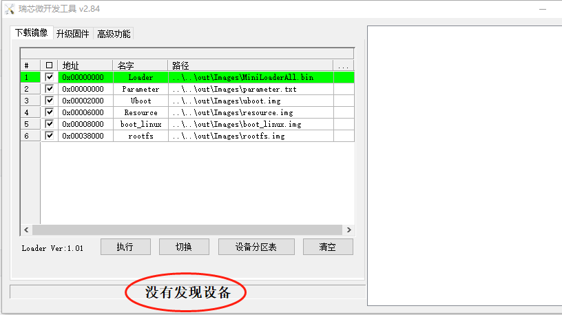
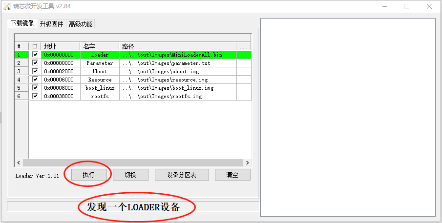
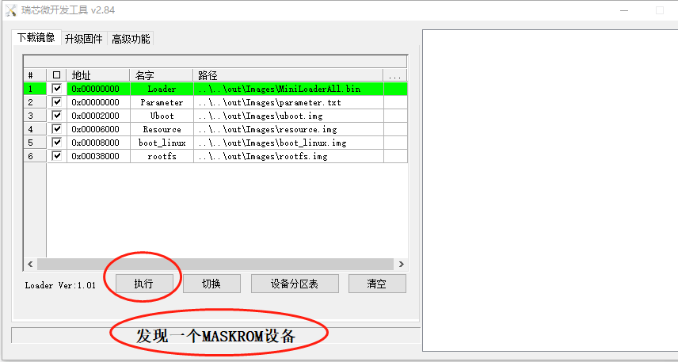
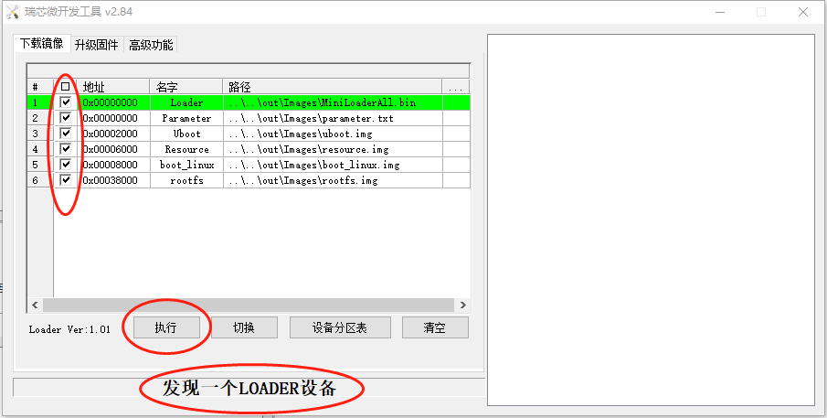
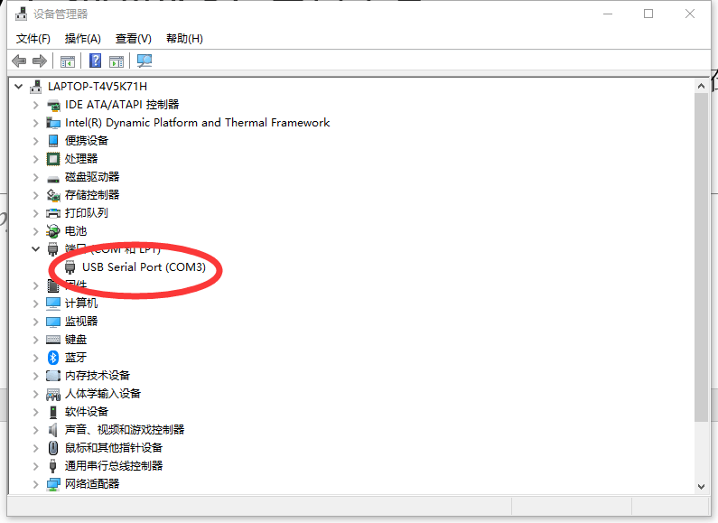
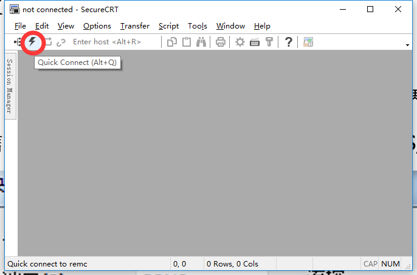
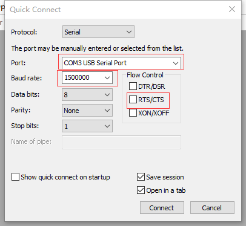

# RK3588 边缘计算快速入门

[TOC]

---

## 前言

边缘计算是针对**Toybrick RK3588系列开发板**推出一套基于Debian11、高性能，应用于边缘计算产品的解决方案。

如下描述边缘计算SDK的快速入门，包括搭建系统环境、下载源码、源码编译、固件烧写和串口调试等。

更多信息见Toybrick官方网站：[Toybrick Wiki (rock-chips.com)](https://t.rock-chips.com/wiki.php)。

为了方便文档描述，约定如下变量定义：

- BOARD：开发板/产品型号；如TB-RK3588X0开发板的型号是TB-RK3588X0。
- DTB：内核设备树；如TB-RK3588X0开发板的产品内核设备树是rk3588-toybrick-x0-linux。
- ROOT_DIR：边缘计算SDK的工作目录；文档中所示的目录为/home/toybrick/work/edge。
- CHIP：开发板的芯片型号；当前边缘计算SDK支持的芯片型号为rk3588或rk3568。
- OUT_DIR：编译生成的镜像路径${ROOT_DIR}/out/${CHIP}/${BOARD}/images ，如TB-RK3588X0的路径为/home/toybrick/work/edge/out/rk3588/TB-RK3588X0/images。

## 搭建系统环境

### 编译主机系统要求

- Ubuntu18.04及以上和Debian11版本，内存推荐16GB及以上。
- 系统的用户名不能有中文字符。
- 只能使用普通用户搭建开发环境，不允许用root用户执行。

### 安装编译依赖基础软件

#### Debain系统安装依赖

```shell
sudo apt -y install python lz4 coreutils qemu qemu-user-static python3 \
devicetree-compiler clang bison flex lld libssl-dev bc genext2fs git make
```

#### Ubuntu系统安装依赖

```shell
sudo apt -y install python lz4 coreutils qemu qemu-user-static python3 \
device-tree-compiler clang bison flex lld libssl-dev bc genext2fs git make
```

## 获取源码

### SSH下载

```shell
git clone git@github.com:rockchip-toybrick/edge.git
```

### HTTP下载

```shell
git clone https://github.com/rockchip-toybrick/edge.git
```

## 固件下载

1. 从百度网盘或OneDriver下载镜像，下载链接：

   **TB-RK3588X0** (TB-RK3588X0-IMAGES.tar.gz)：[百度网盘](https://eyun.baidu.com/s/3dGofGR3)  [OneDrive](https://rockchips-my.sharepoint.com/:f:/g/personal/addy_ke_rockchips_onmicrosoft_com/EqkdA85flEdHvxShK_872xkB05Kv2RY6zCYAEch7u_iKzQ?e=eQMiqR) 

2. 将下载好的镜像解压到源码路径的out/rk3588路径

   ```shell
   tar zxvf ${IMAGES} -C ${ROOT_DIR}/out/rk3588
   ```

## 编译配置

### 设置配置信息

执行如下执行命令，输入产品型号的序号（如：TB-RK3588X0开发板所对应的序号为0）设置配置信息：

```shell
./edge set

[EDGE DEBUG] Board list:
> rk3588
0. TB-RK3568X0
Enter the number of the board: 0
```

***注意：每次更新或修改相关代码后，请重新执行此命令，更新配置。***  

### 查看配置信息

执行如下命令，查看当前配置信息：

```shell
./edge env

[EDGE DEBUG] root path: /home/toybrick/work/edge
[EDGE DEBUG] out path: /home/toybrick/work/edge/out/rk3588/TB-RK3588X0/images
[EDGE DEBUG] board: TB-RK3588X0
[EDGE DEBUG] chip: rk3588
[EDGE DEBUG] arch: arm64
[EDGE DEBUG] > Uboot:
[EDGE DEBUG] config: rk3588-toybrick
[EDGE DEBUG] > Kernel:
[EDGE DEBUG] config: rk3588_edge.config rk3588_toybrick.config
[EDGE DEBUG] linuxdtb: rk3588-toybrick-x0-linux
[EDGE DEBUG] androiddtb: rk3588-toybrick-x0-android
[EDGE DEBUG] initrd: True
[EDGE DEBUG] docker: False
[EDGE DEBUG] debug: 0xfeb50000
```

### 配置信息说明

#### 公共配置

公共配置保存在vendor/common/config.json，其中值为“not set”的配置项必须在《板级配置》中设置；其他配置项可根据实际需要在《板级配置》中修改。

公共配置项包含：

1. kernel：Kernel的配置信息。

   - config：内核menuconfig配置，默认值为rk3588_edge.config rk3588_tobrick.config，编译时会加载rockchip_linux_defconfig、rk3588_edge.config和rk3588_toybrick.config。

     如果有需要增减内核配置可修改kernel/linux-5.10/arch/arm64/configs/rk3588_toybrick.config。

   - initrd：是否加载initrd.img，initrd可以让系统进入紧急修复模式，详见《Rockchip_Developer_Guide_Linux_Edge_Debian_CN.pdf》的紧急模式章节，默认值为true。

   ​        说明：启用initrd的优点是每次启动时都会检查并修复由于异常断电导致的文件系统损坏；缺点是启动会变慢。

   - docker：是否需要支持docker；支持docker会增加不少config配置项，默认值为false。

#### 板级配置

公共配置保存在vendor/${CHIP}/${BOARD}/config.json，其值会覆盖公共配置的同名配置项的值。

板级配置项包含：

1. board：开发板或产品型号，其值必须和vendor/${CHIP}目录下的${BOARD}目录名一致。

2. chip：芯片型号，目前支持rk3568。

3. arch：芯片架构，目前支持的两颗芯片都是arm64。

4. uboot：Uboot的配置信息

   - config：uboot的编译配置信息，默认为rk3588-toybrick。

     如果有需要增减uboot配置可修改uboot/configs/rk3588-toybrick.config。

5. kernel：内核的配置信息

   - linuxdtb：产品/开发板的内核设备树文件名，如RK3588 EVB1开发板的dtbname为rk3588-toybrick-x0-linux。
   - androiddtb：产品/开发板的内核设备树文件名，如RK3588 EVB1开发板的dtbname为rk3588-toybrick-x0-android。

#### 注意事项

- 产品目录下的config.json只需要添加需要修改的字段即可。
- edge脚本首先会加载vendor/common/config.json；然后加载vendor/${CHIP}/${BOARD}/config.json，更新相同字段的值。
- RK3588和RK3588s芯片的配置信息里的kernel子集的chip值都设置为：**rk3588**。

## 镜像编译

### 一键编译

执行如下命令编译所有镜像（包括MiniLoaderAll.bin，uboot.img，kernel.img，resource.img），保存在OUT_DIR目录：

```shell
./edge build -a
```

### 编译Uboot镜像

执行如下命令编译生成MiniLoaderAll.bin和uboot.img镜像，保存在OUT_DIR目录：

```shell
./edge build -u
```

### 编译kernel镜像

执行如下命令编译生成boot_linux.img和resource.img，保存在OUT_DIR目录：

```shell
./edge build -k
```

### 制作android boot镜像

1. 把android镜像里的boot.img拷贝到kernel/linux-5.10/boot_android.img

2. 执行如下命令编译生成boot.img，保存在OUT_DIR目录：

   ```shell
   ./edge build -b
   ```

### 查看编译帮助

查看支持的编译参数：

```shell
./edge build -h
```

## 烧写镜像

### 进入烧写模式

#### 进入loader烧写模式

1. 连接Type-C口到电脑PC端，按住主板的V+/Recovery按键不放。
2. 开发板供电12V，若已经上电，按下复位按键。
3. 当开发板进入loader模式后，松开按键。
4. 参考《查询烧写状态》章节，确认开发板进入loader模式。

#### 进入maskrom烧写模式

1. 连接Type-C口到电脑PC端，按住主板的Maskrom按键不放。
2. 开发板供电12V，若已经上电，按下复位按键。
3. 当开发板进入loader模式后，松开按键。
4. 参考《查询烧写状态》章节，确认开发板进入maskrom模式。

### 查询烧写状态

#### Linux主机查询

执行如下命令查询烧写状态:

```shell
./edge flash -q
```

- none：表示开发板未进入烧写模式。
- loader：表示开发板进入loader烧写模式。
- maskrom：表示开发板进入maskrom烧写模式。

#### Windows主机查询

双机打开tools\RKDevTool_Release_v2.84目录下的RKDevTool.exe，界面显示：  

- 没有发现设备（如果图1-1所示）：表示开发板未进入烧写模式。

- 发现一个LOADER设备（如图1-2所示）：表示开发板进入loader烧写模式。

- 发现一个MASKROM设备（如图1-3所示）：表示开发板进入maskrom烧写模式。



​                                                                        图1-1：没有发现设备



​                                                                        图1-2：发现一个LOADER设备



​                                                                        图1-3：发现一个MASKROM设备

### LINUX主机烧写镜像

#### 烧写所有镜像

烧写所有镜像包括：MiniLoaderAll.bin, uboot.img, resource.img, boot_linux.img，rootfs.img和parameter.txt

```shell
./edge flash -a
```

#### 烧写uboot镜像

烧写镜像：MiniLoaderAll.bin，uboot.img和parameter.txt

```shell
./edge flash -u
```

#### 烧写kernel镜像

烧写镜像：boot_linux.img和resource.img

```shell
./edge flash -k
```

#### 烧写文件系统镜像

烧写镜像：rootfs.img

```shell
./edge flash -r
```

#### 查看烧写帮助

查看支持的烧写参数：

```shell
./edge flash -h
```

### Windows主机烧写镜像

1. 双机打开tools\RKDevTool_Release_v2.84目录下的RKDevTool.exe。

2. 确认开发板已经进入loader或者maskrom烧写模式。

3. 打勾选择需要烧写的镜像。

   ***注意：Loader和Parmeter选项建议打勾选择，其他选项根据需要打勾选择。***  

4. 点击“执行”按钮，开始烧写固件（如图2-1所示）。

   

​                                                                        图2-1：烧写固件

## 串口调试

### 串口连接

用USB线连接主机的USB host口和开发板的调试口(通常开发板上的调试口边上有标有类似"DEBUG" 或 “UART TO USB”的丝印)。

### Windows主机调试

#### 获取端口号

打开设备管理器获取调试串口的端口号，如图3-1所示：



​                                                                        图3-1：获取调试端口号

#### 配置调试串口信息

打开串口工具SecureCRT, 点击"快速连接"按钮，打开调试串口配置界面如图3-2和图3-3所示：

1. Port: 选择设备管理器显示的端口号
2. 波特率： 1500000
3. 禁止流控：不勾选RTS/CTS



​                                                                        图3-2：SecureCRT



​                                                                        图3-3：配置调试串口信息

### Linux主机调试

#### 安装minicom

```shell
sudo apt -y install minicom
```

#### 配置调试窗口信息

按如下步骤，配置保存串口信息（此步骤执行一次即可）：

1. 执行如下命令打开minicom

   ```shell
   sudo minicom -s
   ```

2. 进入串口设置界面：输入CTRL-A Z

   ```shell
   +-------------------------------+
   | Filenames and paths           |
   | File transfer protocols       |
   | Serial port setup             |
   | Modem and dialing             |
   | Screen and keyboard           |
   | Save setup as dfl             |
   | Save setup as                 |
   | Exit                          |
   +-------------------------------+
   ```

3. 端口设置：选择"Serial port setup"

4. 设置串口设备： 输入"A"，填入"/dev/ttyUSB0", 然后按回车确定

5. 禁止流控：输入“F”，按回车确定

6. 设置波特率：输入“E”，再输入“A”直到显示"Current 1500000 8N1", 然后按回车确认

7. 配置完成后，界面显示

   ```shell
   +--------------------------------------------------------+
   | A -        Serial Device          : /dev/ttyUSB0       |
   | B -        Lockfile Location      : /var/lock          |
   | C -        Callin Program         :                    |
   | D -        Callout Porgram        :                    |
   | E -        Bps/Par/Bits           : 1500000 8N1        |
   | F -        Hardware Flow Control  : No                 |
   | G -        Software Flow Control  : No                 |
   +--------------------------------------------------------+
   ```

8. 退出端口设置：按回车

9. 保存配置： 选择"Save setup as dfl"

10. 退出设置：选择"Exit"

#### 运行minicom

```shell
sudo minicom
```
