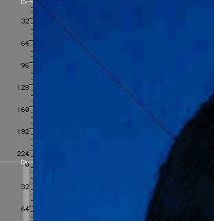

# RGB888格式奇数宽输出存在黑色斜线的问题

文件标识：RK-PC-YF-0002

发布版本：V1.0.0

日期：2020-06-18

文件密级：□绝密   □秘密   □内部资料   ■公开

---

**免责声明**

本文档按“现状”提供，瑞芯微电子股份有限公司（“本公司”，下同）不对本文档的任何陈述、信息和内容的准确性、可靠性、完整性、适销性、特定目的性和非侵权性提供任何明示或暗示的声明或保证。本文档仅作为使用指导的参考。

由于产品版本升级或其他原因，本文档将可能在未经任何通知的情况下，不定期进行更新或修改。

**商标声明**

“Rockchip”、“瑞芯微”、“瑞芯”均为本公司的注册商标，归本公司所有。

本文档可能提及的其他所有注册商标或商标，由其各自拥有者所有。

**版权所有** **© 2019** **瑞芯微电子股份有限公司**

超越合理使用范畴，非经本公司书面许可，任何单位和个人不得擅自摘抄、复制本文档内容的部分或全部，并不得以任何形式传播。

瑞芯微电子股份有限公司

Rockchip Electronics Co., Ltd.

地址：     福建省福州市铜盘路软件园A区18号

网址：     [www.rock-chips.com](http://www.rock-chips.com)

客户服务电话： +86-4007-700-590

客户服务传真： +86-591-83951833

客户服务邮箱： [fae@rock-chips.com](mailto:fae@rock-chips.com)

----

**前言**

本文主要对 RGA的**RGB888格式奇数宽输出存在黑色斜线的问题** 进行说明，整理调试流程，整理相关客户Redmine，提供相关工程师调试参考。

**读者对象**

本文档主要适用一下工程师：

技术支持工程师

软件开发工程师

**修订记录**

| 日期       | 版本 | 作者 | 修订说明 |
| ---------- | ---- | ---- | -------- |
| 2020-06-24 | V1.0 | 李煌 | 初始版本 |

**目录**

------

[TOC]

------

**关键词：RGA，黑线，RGB888，kernel**

## 平台版本

​	适用平台：

| RGA 版本 | kernel 版本  |
| -------- | ------------ |
| RGA2     | Android 10.0 |


## 问题描述

RGA目标Dst格式为RGB888 或者 BGR888 时，且输出图像的宽为奇数宽时，图像上会出现非预期的黑色斜线。

现象图片：




## 解决方案

在 kernel/ 目录打上patch

补丁文件 0001-video-rockchip-rga2-fixup-black-slash-when-use-rgb88.patch

位于以下目录：[补丁目录](./patch/kernel)


## SDK commit

目前该patch 仅在4.4分支上存在。4.19 暂未合并。

```
仓库：kerenl
分支：rk29/develop-4.4
commit message
commit 7552f8d9a9d6b2ea64f3f658e8341c92f4e89b5f
Author: Putin Lee <putin.li@rock-chips.com>
Date:   Fri May 15 11:47:41 2020 +0800

    video/rockchip: rga2: fixup black slash when use rgb888 output with odd width

    Change-Id: I8045880559628904d320da04c8df89a34055ce99
    Signed-off-by: Putin Lee <putin.li@rock-chips.com>

```


##相关Redmine

无


