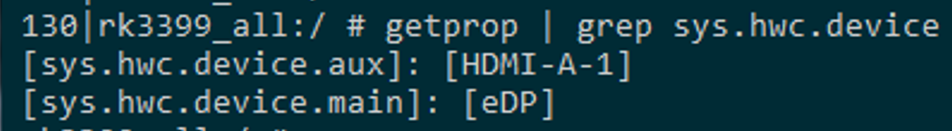
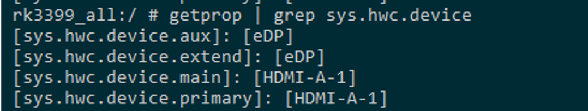

# 主副屏配置功能说明

**关键词：** **主副屏、显示、配置**

发布版本：1.0

作者邮箱：bin.li@rock-chips.com

日期：2020.02

文件密级：公开

----

**前言**

本文主要对 RK 相关平台主副屏配置功能 与 操作方法进行说明。

**读者对象**

本文档主要适用一下工程师：

技术支持工程师

软件开发工程师

**修订记录**

| 日期       | 版本 | 作者 | 修订说明                |
| ---------- | ---- | ---- | ----------------------- |
| 2020-03-01 | V1.0 | 李斌 | 初始版本                |
| 2020-03-01 | V1.1 | 李斌 | 添加Redmine 242890 案例 |
| 2020-03-06 | V1.2 | 李斌 | 添加Redmine 234212 案例 |

---

[TOC]

## 主副屏介绍：

Android 系统支持多屏显示，其中包括三种设备类型：

- **Build-in Display Device：**称为 **内置屏** 或 **主屏** ，系统所有UI渲染布局以主屏为主，也就是通常会满足主屏的点对点显示需求，也就是说屏幕分辨率为1080p，那么系统的所有UI就按1080p的分辨率布局进行渲染输出；
- **External Display Device :** 称为 **外置屏** 或 **副屏** ，通常是将主屏的显示内容投射到副屏上，也就是双屏同显，通常为支持热插拔的显示设备，例如HDMI、DP等；
- **Virtual Display Device:** 称为 **虚拟屏** ，通常没有实际的硬件显示设备，但是也会将主屏的内容投射到第三方，比如，录制屏幕就是将主屏的内容投射到编码器输出为视频文件等。


## 主副屏设置建议：

所以主屏与副屏的配置就尤为重要，这个取决于产品的应用场景，比如说：

- MIPI屏幕的平板，支持HDMI输出信号：建议配置主屏-MIPI，副屏-HDMI
- BOX盒子，支持HDMI / DP，默认输出HDMI口：建议配置主屏-HDMI，副屏-DP

支持多屏输出的设备中，需要**优先满足显示效果** \ **日常使用频率高** 的屏幕设置为主屏。


## 平台支持情况：

主副屏目前仅支持 DRM 平台，故以下平台可支持功能：

| 芯片平台         | Android 平台                   |
| ---------------- | ------------------------------ |
| RK3399           | Android 7.1 / 8.1 / 9.0 / 10.0 |
| RK3288           | Android 7.1 / 8.1 / 9.0 / 10.0 |
| RK3368           | Android 7.1 / 8.1 / 9.0 / 10.0 |
| RK3328 / RK3228H | Android 8.1 / 9.0 / 10.0       |
| RK3326 / PX30    | Android  8.1 / 9.0 / 10.0      |
| RK312x / RK3126c | Android  8.1 / 9.0 / 10.0      |


## 配置方法介绍：

### 涉及属性：

属性由于Android 版本的差异，不同Android 版本使用的属性略由不同，但是功能上是一样的

```c++
// Android 7.1 / 8.1
sys.hwc.device.primary          //设置主屏设备类型，由用户设置
sys.hwc.device.extend           //设置副屏设备类型，由用户设置
sys.hwc.device.main             //查询当前系统主屏设备类型，由系统设置
sys.hwc.device.aux              //查询当前系统副屏设备类型，由系统设置

// Android 9.0 以上版本
vendor.hwc.device.primary          //设置主屏设备类型，由用户设置
vendor.hwc.device.extend           //设置副屏设备类型，由用户设置
vendor.hwc.device.main             //查询主屏当前设置设备，由系统设置
vendor.hwc.device.aux              //查询副屏当前设置设备，由系统设置
```


### 属性格式：

格式为 “Disp-type1,disp-type2,disp-type3-...”

```c++
// Android 7.1 / 8.1
//默认主屏设备类型  
DRM_MODE_CONNECTOR_LVDS      LVDS  
DRM_MODE_CONNECTOR_eDP       eDP  
DRM_MODE_CONNECTOR_DSI       DSI  
DRM_MODE_CONNECTOR_VIRTUAL   Virtual  
DRM_MODE_CONNECTOR_TV        TV  
DRM_MODE_CONNECTOR_DPI       DPI  
sys.hwc.device.primary=eDP,LVDS,VGA
sys.hwc.device.extend=HDMI-A-1,HDMI-A-2
sys.hwc.device.main=eDP
sys.hwc.device.aux=HDMI-A-1

// Android 9.0 以上版本
vendor.hwc.device.primary=eDP,LVDS,VGA
vendor.hwc.device.extend=HDMI-A-1,HDMI-A-2
vendor.hwc.device.main=eDP
vendor.hwc.device.aux=HDMI-A
```

其中，设置的语义为：

- sys.hwc.device.primary：
  - 当前系统可将设备类型为  eDP，LVDS，VGA 的显示设备设置为主屏；
  - 优先级：eDP > LVDS > VGA，即当eDP与LVDS同时存在时，系统采用eDP作为主屏；
- sys.hwc.device.extend：
  - 当前系统可将设备类型为  HDMI-A-1，HDMI-A-2 的显示设备设置为副屏；
  - 优先级：HDMI-A-1 > HDMI-A-2 ，即当 HDMI-A-1 与 HDMI-A-2 同时存在时，系统采用eDP作为主屏；
- sys.hwc.device.main：当前系统将eDP设置为系统主屏，所有系统UI根据eDP设备分辨率进行渲染
- sys.hwc.device.aux：当前系统将HDMI-A-1设置为系统副屏


备注：

HDMI-A-1 与 HDMI-A-2，是disp-type同为 HDMI-A,可通过 type_id 进行区分，也就是 HDMI-A后的索引。


### 配置方法：

由用户设备的属性即为需要配置的属性，日常测试可以直接修改设备上的 build.prop， 修改该文件可在开机过程中直接将内部设置的属性加载入系统，故修改完成后，需要重启设备：

```c++
// Android 7.1 / 8.1
/system/build.prop

// Android 9.0 以上版本
/vendor/build.prop

//若测试完成后，可将确定的属性值添加到 sdk-project/device/rockchip/common/system.prop 文件
```


### 属性缺省值：

用户若未设置主屏屏相关属性，则系统会使用缺省值：

```c++
//默认主屏设备类型，不在此次列的均未副屏设备类型
DRM_MODE_CONNECTOR_LVDS      LVDS  
DRM_MODE_CONNECTOR_eDP       eDP  
DRM_MODE_CONNECTOR_DSI       DSI  
DRM_MODE_CONNECTOR_VIRTUAL   Virtual  
DRM_MODE_CONNECTOR_TV        TV  
DRM_MODE_CONNECTOR_DPI       DPI  
    
//完整的设备类型如下：
    { DRM_MODE_CONNECTOR_Unknown, "unknown" },
	{ DRM_MODE_CONNECTOR_VGA, "VGA" },
	{ DRM_MODE_CONNECTOR_DVII, "DVI-I" },
	{ DRM_MODE_CONNECTOR_DVID, "DVI-D" },
	{ DRM_MODE_CONNECTOR_DVIA, "DVI-A" },
	{ DRM_MODE_CONNECTOR_Composite, "composite" },
	{ DRM_MODE_CONNECTOR_SVIDEO, "s-video" },
	{ DRM_MODE_CONNECTOR_LVDS, "LVDS" },
	{ DRM_MODE_CONNECTOR_Component, "component" },
	{ DRM_MODE_CONNECTOR_9PinDIN, "9-pin DIN" },
	{ DRM_MODE_CONNECTOR_DisplayPort, "DP" },
	{ DRM_MODE_CONNECTOR_HDMIA, "HDMI-A" },
	{ DRM_MODE_CONNECTOR_HDMIB, "HDMI-B" },
	{ DRM_MODE_CONNECTOR_TV, "TV" },
	{ DRM_MODE_CONNECTOR_eDP, "eDP" },
	{ DRM_MODE_CONNECTOR_VIRTUAL, "Virtual" },
	{ DRM_MODE_CONNECTOR_DSI, "DSI" },
	{ DRM_MODE_CONNECTOR_DPI, "DPI" },
```

注意事项：

- 对于已经确认主副屏类型的产品，建议将主副屏属性配置正确，避免可能存在的显示问题。

- 对于仅存在主屏的产品，也就是不考虑多屏显示，建议将  sys.hwc.device.extend=NULL

## 配置示例：

环境为 RK3399 Android 7.1，显示的设备类型有 eDP \ HDMI-A

1. 连接HDMI开机后，通过以下命令查询当前系统主副屏设置情况：

```c++
getprop sys.hwc.device.main     //查询主屏当前设置显示设备
getprop sys.hwc.device.aux      //查询副屏当前设置显示设备
```



以上Log表明当前系统连接主屏为eDP，副屏为HDMI-A-1，用户配置属性未设置，故采用缺省值。

2. 需要修改主副屏逻辑关系，那么以下命令就可以设置：

```c++
//直接通过命令行修改：
setprop sys.hwc.device.primary HDMI-A-1   //设置HDMI-A-1为主屏  
setprop sys.hwc.device.extend eDP        //设置eDP为副屏 
stop;start   //设置完需要Android重启生效,需要reboot生效需要写入build.prop中

//修改build.prop文件：
busybox vi /system/build.prop //利用busybox vi 工具直接修改 /system/build.prop 文件，加入字段
```

3. 设置完成并且重启后，可通过查看相关属性确认修改，命令与输出如下：

```c++
getprop | grep sys.hwc.device
```



确认，主副屏关系已经按预设值进行设置。


## 相关Redmine:

- Defect #242890 ： https://redmine.rockchip.com.cn/issues/242890#change-2223289

  主副屏属性未配置导致的显示不全问题，提供设置方法后解决问题

- Support #234212：https://redmine.rockchip.com.cn/issues/234212#change-2231880

  RK3399_ANDROID7.1-Industry-SDK_V1.0安卓4K输出DDR参数设置问题