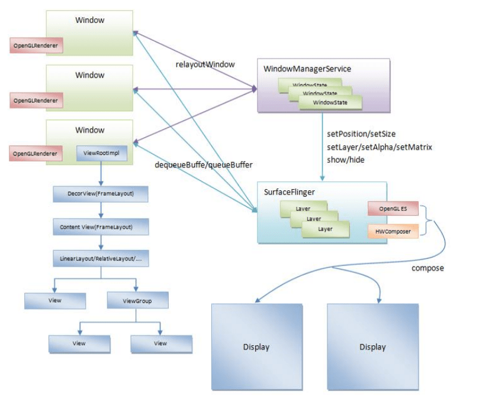
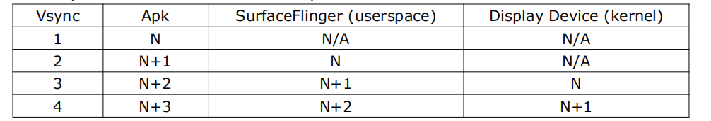
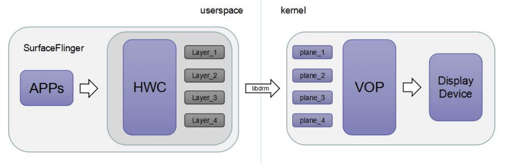
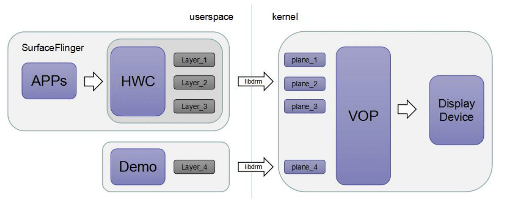
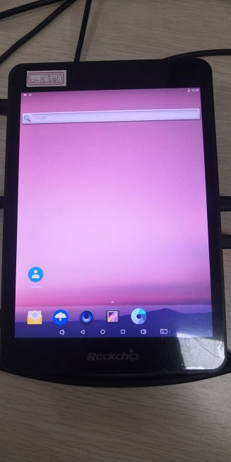
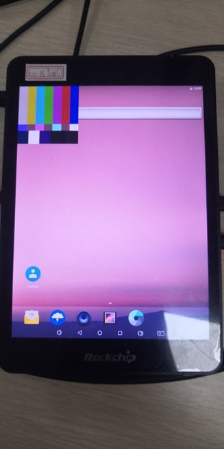

# 预留Plane-快速倒车说明与调试

文件标识：RK-PC-YF-0002

发布版本：V1.0.0

日期：2020-06-11

文件密级：□绝密   □秘密   □内部资料   ■公开

---

**免责声明**

本文档按“现状”提供，瑞芯微电子股份有限公司（“本公司”，下同）不对本文档的任何陈述、信息和内容的准确性、可靠性、完整性、适销性、特定目的性和非侵权性提供任何明示或暗示的声明或保证。本文档仅作为使用指导的参考。

由于产品版本升级或其他原因，本文档将可能在未经任何通知的情况下，不定期进行更新或修改。

**商标声明**

“Rockchip”、“瑞芯微”、“瑞芯”均为本公司的注册商标，归本公司所有。

本文档可能提及的其他所有注册商标或商标，由其各自拥有者所有。

**版权所有** **© 2019** **瑞芯微电子股份有限公司**

超越合理使用范畴，非经本公司书面许可，任何单位和个人不得擅自摘抄、复制本文档内容的部分或全部，并不得以任何形式传播。

瑞芯微电子股份有限公司

Rockchip Electronics Co., Ltd.

地址：     福建省福州市铜盘路软件园A区18号

网址：     [www.rock-chips.com](http://www.rock-chips.com)

客户服务电话： +86-4007-700-590

客户服务传真： +86-591-83951833

客户服务邮箱： [fae@rock-chips.com](mailto:fae@rock-chips.com)

----

**前言**

本文主要对 **预留图层功能** 的应用 **快速倒车视频显示** 进行说明，整理调试流程，整理相关客户Redmine.

**读者对象**

本文档主要适用一下工程师：

技术支持工程师

软件开发工程师

**修订记录**

| 日期       | 版本 | 作者 | 修订说明 |
| ---------- | ---- | ---- | -------- |
| 2020-06-11 | V1.0 | 李斌 | 初始版本 |

**目录**

---

[TOC]

**关键词：** **预留图层、快速倒车、低延迟、高效显示**

## 平台版本

| 芯片平台      | Android 版本                                     |
| ------------- | ------------------------------------------------ |
| RK3399        | Android 7.1 / 8.1 / 9.0 / 10.0  (已全部测试通过) |
| RK3368        | Android 7.1 / 8.1 / 9.0 (已全部测试通过)         |
| RK3288        | Android 7.1 / 8.1 / 9.0 (已全部测试通过)         |
| RK3326 / PX30 | Android 8.1 / 9.0 (已全部测试通过)               |
| RK3328        | Android 8.1 / 9.0 (已全部测试通过)               |


## 原理介绍

### Android 显示框架简要介绍

Android 显示框架大致如下图所示：



重点关注 SurfaceFlinger services 流程之后的流程，SurfaceFlinger 负责处理所有应用的显示请求， 基本驱动时间单位为 Vsync 时间（硬件触发）。后端 composer 组件有 GPU(OpenGL ES)与 HWComposer(Overlay)，负责将所有 apk 请求送显的图形内容预合成输出至 Display Devices 上。 

Vsync 时间取决于屏幕刷新率： 

​		Vsync(ms) = 1000ms/dpy fps 

​		即：60 Fps 对应 Vsync 时间为 16.6ms，30 Fps 对应 33.2ms 

通常 apk 请求绘图之后，至少需要 3 个 Vsync 时间才可以将图形送显至显示设备： 



由上图可知 apk 画好 N 之后，第三个 Vsync 时间才将内容送显到显示器上，故必然存在 3*Vsync 时间 

的显示延迟，并且若系统显示流程存在阻塞行为（例如 composer 耗时长），均会增加显示延时。


### DRM Hardware Composer 介绍

Hardware Composer 作为系统显示策略的分配者，决定当前系统待显示的 Layer 的合成方式，通常合 成方式有：GPU(GLES)与 VOP(Overlay)。 

SurfaceFlinger 接收到的 Layer List 最终会通过 HWcomposer commit 至 kernel 驱动，并且 kernel 驱动会再下一个 Vsync 触发时，将内容刷新至屏幕上。 


HWComposer 配置基本流程如下： 



HWC 将 SurfaceFlinger 送显的 Layer 分配给 VOP 存在的 plane 上，最终由 VOP 将 plane 上的内容送显。


### Plane Reserved 显示原理

基于 Android 显示框架及 Hardware Composer 工作原理，Plane Reserved 显示工作原理如下： 



在 Android 正常的显示流程，将其中一个 Plane_4 预留出来，系统不去使用，Plane_4 配置信息完全由 Demo 设置，并与系统配置的 plane 一起送显。 

- 优点：
  - 显示低延迟，理论可以做到一个HW-Vsync时间以内的延迟；
  - 高效，显示内容无需经过SurfaceFlinger显示框架，减少系统开销；

- 缺点：

  - 逻辑复杂，与系统显示框架交互的逻辑就需要应用自己控制，包括图层的显示与关闭
  - 无法通过标准接口获取送显内容：例如截图，录屏等

  

**快速倒车应用：** 快速倒车视频显示方案就是利用 Camera  driver 向预留的图层直接送显倒车视频数据，达到快速显示的目的，所以需要明确两点：

- HWC仅仅是预留底层的硬件资源，保证系统不操作预留的硬件资源，也就是说预留显示图层之后，所有显示图层的管理权就已经移交给实际送显的 Camera driver；
- Camera driver 作为实际倒车视频的生产者，是承担视频送显工作的，并且需要对预留的显示图层进行管理，包括Enable/Disable/Rotate等


## 源码分析

设备采用 RK3399 挖掘机，屏幕类型为 eDP，分辨率为 1536x2048

### HWC源码分析

HWC在快速倒车应用功能的作用仅仅是预留图层，HWC不去对目标Plane硬件资源进行操作，将此硬件资源预留给Camera驱动。

所以HWC只需要做一件事，就是预留目标图层，而方法就是找到目标的Plane并且设置Reserved标志:

- **属性说明：**系统提供两个属性进行设置：

```c++
//Android 7.1 / 8.1 
sys.hwc.win1.reserved  //1:系统预留图层 0：系统不预留图层
sys.hwc.win1.zpos      //系统预留的zpos坐标值，范围0-3，通常建议设置0或3，即最底层或最顶层

//Android 9.0 / 10.0
vendor.hwc.win1.reserved  //1:系统预留图层 0：系统不预留图层
vendor.hwc.win1.zpos      //系统预留的zpos坐标值，范围0-3，通常建议设置0或3，即最底层或最顶层
```

- **源码说明：**

```c++
//文件位置：hardware/rockchip/hwcomposer/hwcomposer.cpp
static int hwc_prepare(hwc_composer_device_1_t *dev, size_t num_displays,
                       hwc_display_contents_1_t **display_contents) {
(...)
for (std::vector<PlaneGroup *> ::const_iterator iter = plane_groups.begin();
  iter != plane_groups.end(); ++iter)
  {
#ifdef USE_PLANE_RESERVED //首先确保 Android.mk 使能 USE_PLANE_RESERVED，开启预留功能
     // win1_reserved 由 sys.hwc.win1.reserved  属性值决定
     // GetCrtcSupported(*crtc, (*iter)->possible_crtcs) ，确保Plane挂载在目标CRTC上
     // ((*iter)->planes.at(0)->type() == DRM_PLANE_TYPE_OVERLAY 确定type类型
     // (*iter)->planes.at(0)->get_yuv() 是否支持YUV数据
     // 这里我们通过 DRM_PLANE_TYPE_OVERLAY 与 是否支持YUV数据来确定目标图层
     // RK3326 此处需要修改，需要将 (*iter)->planes.at(0)->get_yuv() 删除
     if (win1_reserved > 0 && GetCrtcSupported(*crtc, (*iter)->possible_crtcs) &&
          ((*iter)->planes.at(0)->type() == DRM_PLANE_TYPE_OVERLAY) &&
          (*iter)->planes.at(0)->get_yuv())
        {
            (*iter)->b_reserved = true;
            for(std::vector<DrmPlane*> ::const_iterator iter_plane = 
                (*iter)->planes.begin();iter_plane != (*iter)->planes.end(); 
                ++iter_plane)
            {
                (*iter_plane)->set_reserved(true);
            }
            //检查系统是否设置正确，可以检查是否有此log输出
            //setprop vendor.hwc.log 511;logcat -c ;logcat | grep USE_PLANE_RESERVED
            ALOGD_IF(log_level(DBG_DEBUG),"Enable USE_PLANE_RESERVED, plane share_id = %" PRIu64 "", (*iter)->share_id);
            continue;
        }
#endif   
}
```

- **功能使能：** HWC 模块打开  USE_PLANE_RESERVED 预编译选项，并且设置使能属性即可：

```diff
hardware/rockchip/hwcomposer$ git diff
diff --git a/Android.mk b/Android.mk
index b475ccd..48a4711 100755
--- a/Android.mk
+++ b/Android.mk
@@ -413,7 +413,7 @@ LOCAL_CPPFLAGS += -DDUAL_VIEW_MODE=0
 endif
 
 #USE_PLANE_RESERVED enable
-#LOCAL_CPPFLAGS += -DUSE_PLANE_RESERVED
+LOCAL_CPPFLAGS += -DUSE_PLANE_RESERVED
 
 # RK_RGA_PREPARE_ASYNC and RK_RGA_COMPSITE_SYNC are exclusive.
 #      RK_RGA_PREPARE_ASYNC: use async rga in hwc_prepare.
```

设置属性：

```
//Android 7.1 / 8.1 
adb shell setprop sys.hwc.win1.reserved 1 
adb shell sys.hwc.win1.zpos 3

//Android 9.0 and above
vendor.hwc.win1.reserved 1
vendor.hwc.win1.zpos 3  // RK3326 需要设置为2
```


## 调试步骤

### HWC 使能预留图层

1. 检查属性是否设置：

```shell
# Android 7.1 / 8.1 
getprop sys.hwc.win1.reserved  //确保输出为1
getprop sys.hwc.win1.zpos      //确保输出为你期望设置的值，建议为3

# Android 9.0 and above
getprop vendor.hwc.win1.reserved //确保输出为1
getprop vendor.hwc.win1.zpos     //确保输出为你期望设置的值，建议为3，RK3326 为 2
```

2. 检查是否有预留的日志输出：

```shell
# 利用以下命令，查看是否有输出，若有输出，则说明HWC使能了预留功能，若日志输出，则返回 HWC源码分析检查代码修改
#Android 7.1 / 8.1 
adb shell setprop sys.hwc.log 511;logcat -c ;logcat | grep USE_PLANE_RESERVED
#Android 9.0 and above
adb shell setprop vendor.hwc.log 511;logcat -c ;logcat | grep USE_PLANE_RESERVED

# 输出内容如下所示:
# D hwcomposer-drm: Enable USE_PLANE_RESERVED, plane share_id = 62
# D hwcomposer-drm: Enable USE_PLANE_RESERVED, plane share_id = 62
# D hwcomposer-drm: Enable USE_PLANE_RESERVED, plane share_id = 62
# D hwcomposer-drm: Enable USE_PLANE_RESERVED, plane share_id = 62
```

3. 确保系统正常显示的情况下（如Luncher界面，确保正常显示），查看底层硬件配置信息：

```shell
adb shell cat /d/dri/0/summary
rk3399_all:/ # cat /d/dri/0/summary
VOP [ff900000.vop]: ACTIVE
    Connector: eDP
        overlay_mode[0] bus_format[100a] output_mode[f] color_space[0]
    Display mode: 1536x2048p60
        clk[200000] real_clk[200000] type[8] flag[a]
        H: 1536 1548 1564 1612
        V: 2048 2056 2060 2068
    win0-0: ACTIVE
        format: AB24 little-endian (0x34324241)[AFBC] SDR[0] color_space[0]
        csc: y2r[0] r2r[0] r2y[0] csc mode[0]
        zpos: 2
        src: pos[0x0] rect[1536x2048]
        dst: pos[0x0] rect[1536x2048]
        buf[0]: addr: 0x0000000003d06000 pitch: 6144 offset: 0
    win1-0: DISABLED    # Win1-0处于 Disable 状态，结合日志输出，可以确定Win1-0预留成果
    win2-0: ACTIVE
        format: AB24 little-endian (0x34324241) SDR[0] color_space[0]
        csc: y2r[0] r2r[0] r2y[0] csc mode[0]
        zpos: 1
        src: pos[0x0] rect[1536x2048]
        dst: pos[0x0] rect[1536x2048]
        buf[0]: addr: 0x0000000010dc0000 pitch: 6144 offset: 0
    win2-1: DISABLED
    win2-2: DISABLED
    win2-3: DISABLED
    win3-0: ACTIVE
        format: XB24 little-endian (0x34324258) SDR[0] color_space[0]
        csc: y2r[0] r2r[0] r2y[0] csc mode[0]
        zpos: 0
        src: pos[0x0] rect[1536x2048]
        dst: pos[0x0] rect[1536x2048]
        buf[0]: addr: 0x000000000f142000 pitch: 8192 offset: 0
    win3-1: DISABLED
    win3-2: DISABLED
    win3-3: DISABLED
    post: sdr2hdr[0] hdr2sdr[0]
    pre : sdr2hdr[0]
    post CSC: r2y[0] y2r[0] CSC mode[1]
```

以上三步即可确认HWC是否预留Plane资源

### 车载倒车送显用例测试

1. 确保系统正常显示的情况下（如Luncher界面，确保正常显示），查看底层硬件配置信息：

```shell
adb shell cat /d/dri/0/summary
rk3399_all:/ # cat /d/dri/0/summary
VOP [ff900000.vop]: ACTIVE
    Connector: eDP
        overlay_mode[0] bus_format[100a] output_mode[f] color_space[0]
    Display mode: 1536x2048p60
        clk[200000] real_clk[200000] type[8] flag[a]
        H: 1536 1548 1564 1612
        V: 2048 2056 2060 2068
    win0-0: ACTIVE
        format: AB24 little-endian (0x34324241)[AFBC] SDR[0] color_space[0]
        csc: y2r[0] r2r[0] r2y[0] csc mode[0]
        zpos: 2
        src: pos[0x0] rect[1536x2048]
        dst: pos[0x0] rect[1536x2048]
        buf[0]: addr: 0x0000000003d06000 pitch: 6144 offset: 0
    win1-0: DISABLED    # Win1-0处于 Disable 状态，结合日志输出，可以确定Win1-0预留成果
    win2-0: ACTIVE
        format: AB24 little-endian (0x34324241) SDR[0] color_space[0]
        csc: y2r[0] r2r[0] r2y[0] csc mode[0]
        zpos: 1
        src: pos[0x0] rect[1536x2048]
        dst: pos[0x0] rect[1536x2048]
        buf[0]: addr: 0x0000000010dc0000 pitch: 6144 offset: 0
    win2-1: DISABLED
    win2-2: DISABLED
    win2-3: DISABLED
    win3-0: ACTIVE
        format: XB24 little-endian (0x34324258) SDR[0] color_space[0]
        csc: y2r[0] r2r[0] r2y[0] csc mode[0]
        zpos: 0
        src: pos[0x0] rect[1536x2048]
        dst: pos[0x0] rect[1536x2048]
        buf[0]: addr: 0x000000000f142000 pitch: 8192 offset: 0
    win3-1: DISABLED
    win3-2: DISABLED
    win3-3: DISABLED
    post: sdr2hdr[0] hdr2sdr[0]
    pre : sdr2hdr[0]
    post CSC: r2y[0] y2r[0] CSC mode[1]
```

2. 执行用例，查看用例输出日志是否正常：

```shell
rk3399_all:/ # rk-vehicle-test -c rk3399
Soc name: rk3399
Property config:
    Android 8.1 and lower: sys.hwc.win1.reserved=1
    Android 8.1 and lower: sys.hwc.win1.zpos=3
    Android 9.0 and above: vendor.hwc.win1.reserved=1
    Android 9.0 and above: vendor.hwc.win1.zpos=3
initial_win_buffer success! vir_addr = 0x704c706000 , phy_addr = 0x0 , size = 1024000
<<<<< Want to find active CRTC: crtc_id = 61:
         Index =  0, prop_name =          ACTIVE, value = 1
<<<<< To find connector_id = 88, connection = 1,mode w=1536,h=2048
>>>>> Find active connect_id 88
>>>>> Find active crtc 61
<<<<< Check plane = 55 type = 1, acquire win-type = 0 perf = 1
<<<<< Check plane = 58 type = 2, acquire win-type = 0 perf = 1
<<<<< Check plane = 62 type = 0, acquire win-type = 0 perf = 1
>>>>> Find active plane_id = 62
Vop init success!
Vop set success!
Enter a word to close display!

# 用例运行输出正常
```

3. 查看送显画面是否符合预期：

未执行前：



执行用例后，可以看到左上角显示一块500x500的彩条，并且此时去操作系统发现系统显示正常，彩条覆盖在系统显示画面上：



4. 查看底层硬件配置信息是否正常：

```shell
rk3399_all:/ # cat /d/dri/0/summary
VOP [ff900000.vop]: ACTIVE
    Connector: eDP
        overlay_mode[0] bus_format[100a] output_mode[f] color_space[0]
    Display mode: 1536x2048p60
        clk[200000] real_clk[200000] type[8] flag[a]
        H: 1536 1548 1564 1612
        V: 2048 2056 2060 2068
    win0-0: ACTIVE
        format: AB24 little-endian (0x34324241)[AFBC] SDR[0] color_space[0]
        csc: y2r[0] r2r[0] r2y[0] csc mode[0]
        zpos: 0
        src: pos[0x0] rect[1536x2048]
        dst: pos[0x0] rect[1536x2048]
        buf[0]: addr: 0x0000000003d06000 pitch: 6144 offset: 0
    win1-0: ACTIVE  # win1-0 被设置，格式为AB24,大小为500x500 符合预期
        format: AB24 little-endian (0x34324241) SDR[0] color_space[0]
        csc: y2r[0] r2r[0] r2y[0] csc mode[0]
        zpos: 3
        src: pos[0x0] rect[500x500]   # 图像大小为 500x500 符合预期
        dst: pos[0x0] rect[500x500]
        buf[0]: addr: 0x0000000008219000 pitch: 2048 offset: 0
    win2-0: DISABLED
    win2-1: DISABLED
    win2-2: DISABLED
    win2-3: DISABLED
    win3-0: DISABLED
    win3-1: DISABLED
    win3-2: DISABLED
    win3-3: DISABLED
    post: sdr2hdr[0] hdr2sdr[0]
    pre : sdr2hdr[0]
    post CSC: r2y[0] y2r[0] CSC mode[1]
VOP [ff8f0000.vop]: DISABLED
```


## 参考资料 - 各平台Plane资源类型介绍

本模块列举各芯片平台的Plane资源类型的信息，提供给软件开发者参考，更好的移植用例，预留的原则如下：

- 至少保留一层支持 **缩放** 与 **YUV** 的Plane给系统，保证系统正常显示
- 用例配置的图层需要与系统预留的图层保持一致，也就是判断信息需要统一

### RK3399

DRM_PLANE_PERFORMANCE 标志性能强的图层，支持YUV格式，支持缩放的图层：

| win-type      | possible-crtcs | type                                            |
| ------------- | -------------- | ----------------------------------------------- |
| vop_b: win0-0 | 0x00000001     | PRIMARY \| DRM_PLANE_PERFORMANCE                |
| vop_b: win1-0 | 0x00000001     | OVERLAY \| DRM_PLANE_PERFORMANCE                |
| vop_b: win2-0 | 0x00000001     | DRM_PLANE_TYPE_OVERLAY                          |
| vop_b: win3-0 | 0x00000001     | DRM_PLANE_TYPE_CURSOR                           |
| vop_l: win0-0 | 0x00000002     | DRM_PLANE_TYPE_PRIMARY \| DRM_PLANE_PERFORMANCE |
| vop_l: win2-0 | 0x00000002     | DRM_PLANE_TYPE_CURSOR                           |

**其他注意事项：**

- possible-crtcs 表示  vop_b 与 vop_l 的区分，zpos范围为vop_b 为 0-3 ， vop_l 为 0-1
- vop_b: win1-0 必须指定  DRM_PLANE_TYPE_OVERLAY | DRM_PLANE_PERFORMANCE 才能找到，仅指定 DRM_PLANE_TYPE_OVERLAY 只能找到 vop_b: win2-0

### RK3288

DRM_PLANE_PERFORMANCE 标志性能强的图层，支持YUV格式，支持缩放的图层：

| win-type      | possible-crtcs | type                                               |
| ------------- | -------------- | -------------------------------------------------- |
| vop_b: win0-0 | 0x00000001     | DRM_PLANE_TYPE_PRIMARY \| DRM_PLANE_PERFORMANCE    |
| vop_b: win1-0 | 0x00000001     | DRM_PLANE_TYPE_OVERLAY \| DRM_PLANE_PERFORMANCE ** |
| vop_b: win2-0 | 0x00000001     | DRM_PLANE_TYPE_OVERLAY                             |
| vop_b: win3-0 | 0x00000001     | DRM_PLANE_TYPE_CURSOR                              |
| vop_l: win0-0 | 0x00000002     | DRM_PLANE_TYPE_PRIMARY \| DRM_PLANE_PERFORMANCE    |
| vop_l: win1-0 | 0x00000002     | DRM_PLANE_TYPE_OVERLAY\| DRM_PLANE_PERFORMANCE     |
| vop_l: win2-0 | 0x00000002     | DRM_PLANE_TYPE_OVERLAY                             |
| vop_l: win3-0 | 0x00000002     | DRM_PLANE_TYPE_CURSOR                              |

**其他注意事项：**

- possible-crtcs 表示  vop_b 与 vop_l 的区分，zpos范围为vop_b 为 0-3 ， vop_l 为 0-1
- vop_b: win1-0 必须指定  DRM_PLANE_TYPE_OVERLAY | DRM_PLANE_PERFORMANCE 才能找到，仅指定 DRM_PLANE_TYPE_OVERLAY 只能找到 vop_b: win2-0
- vop_l最大输入分辨率为 2560x1600，vop_b为 4096x2304

### RK3368

DRM_PLANE_PERFORMANCE 标志性能强的图层，支持YUV格式，支持缩放的图层：

| win-type      | possible-crtcs | type                                               |
| ------------- | -------------- | -------------------------------------------------- |
| vop_b: win0-0 | 0x00000001     | DRM_PLANE_TYPE_PRIMARY \| DRM_PLANE_PERFORMANCE    |
| vop_b: win1-0 | 0x00000001     | DRM_PLANE_TYPE_OVERLAY \| DRM_PLANE_PERFORMANCE ** |
| vop_b: win2-0 | 0x00000001     | DRM_PLANE_TYPE_OVERLAY                             |
| vop_b: win3-0 | 0x00000001     | DRM_PLANE_TYPE_CURSOR                              |

**其他注意事项：**

- zpos范围为vop_b 为 0-3 
- vop_b: win1-0 必须指定  DRM_PLANE_TYPE_OVERLAY | DRM_PLANE_PERFORMANCE 才能找到，仅指定 DRM_PLANE_TYPE_OVERLAY 只能找到 vop_b: win2-0

### RK3326 / PX30

DRM_PLANE_PERFORMANCE 标志性能强的图层，支持YUV格式，支持缩放的图层：

| win-type      | possible-crtcs | type                                           |
| ------------- | -------------- | ---------------------------------------------- |
| vop_b: win0-0 | 0x00000001     | DRM_PLANE_TYPE_OVERLAY\| DRM_PLANE_PERFORMANCE |
| vop_b: win1-0 | 0x00000001     | DRM_PLANE_TYPE_PRIMARY                         |
| vop_b: win2-0 | 0x00000001     | DRM_PLANE_TYPE_CURSOR ** 需要做YUV2RGBX转换    |
| vop_l: win0-0 | 0x00000002     | DRM_PLANE_TYPE_PRIMARY                         |

**其他注意事项：**

- possible-crtcs 表示 vop_b 与 vop_l 的区分，zpos范围为vop_b 为 0-2 ， vop_l 为 0
- vop_b: win0-0 不支持 RGBA 格式的缩放，建议RGBA格式需要缩放的话转换为RGBX


## 解决方案

### HWC版本

通过以下命令查询HWC版本：

```shell
adb shell getprop | grep ghwc.version
```

| 芯片平台      | 至少更新至以下版本才支持该补丁 |
| ------------- | ------------------------------ |
| RK3399        | 0.55                           |
| RK3368        | 0.55                           |
| RK3288        | 0.55                           |
| RK3326 / PX30 | 0.64                           |

HWC版本需要确保版本存在以下提交：

```
仓库：hardware/rockchip/hwcomposer
分支：rk33/mid/6.0/develop_drm

commit e9155e4dcffcf708ea47c825ca430317e996356e
Author: libin <bin.li@rock-chips.com>
Date:   Tue Dec 25 15:53:44 2018 +0800

    Add plane reserved interface:
    
    Android 8.1 or lower:
      sys.hwc.win1.reserved    1-Enable / 0-Disable
      sys.hwc.win1.zpos        Set Win1 zpos 0-4
    
    Android 9.0 or higher:
      vendor.hwc.win1.reserved 1-Enable / 0-Disable
      vendor.hwc.win1.zpos     Set Win1 zpos 0-4
    
    Change-Id: Ic623ca22d772c8f07c4c592de6289ad666502088
    Signed-off-by: libin <bin.li@rock-chips.com>
```

详细的补丁文件，请查看以下目录：

[补丁目录](patch/hwcomposer/rockchip/hwcomposer)


###车载倒车送显用例

用例从以下目录获取：

[Android 7.1: rk-vehicle-test](bin/7.1)

[Android 8.1: rk-vehicle-test](bin/8.1)

[Android 9.0: rk-vehicle-test](bin/9.0)

[Android 10.0: rk-vehicle-test](bin/10.0)

使用方法：

```shell
rk-vehicle-test -c rk3399   # 可接受的参数有 rk3399/rk3326/rk3288/rk3368
```


## 相关Redmine

暂无


## 附录

### Modetest 工具介绍：

本用例参考Modetest进行修改，Modetest源码位于sdk工程以下目录：

```shell
external/libdrm/tests/modetest/
```

可利用以下命令编译出modetest二进制文件，执行获取相关图层信息：

```shell
mmm external/libdrm/tests/modetest/ -j8
```

介绍需要用到的命令：

```shell
modetest -h //帮助信息
modetest -c //打印 Connector 的信息
modetest -p //打印 CRTC 与 Plane的信息
```

#### Connector相关信息介绍：

```
//执行以下命令后输入log如下：
modetest -c

Connectors:
id	encoder	status		name		size (mm)	modes	encoders
87	0	connected	eDP-1          	0x0		1	86
  modes:
	name refresh (Hz) hdisp hss hse htot vdisp vss vse vtot)
  1536x2048 60 1536 1548 1564 1612 2048 2056 2060 2068 200000 flags: nhsync, nvsync; type: preferred
  
```

可得信息：

- connector-name = eDP，即 connector_type = DRM_MODE_CONNECTOR_eDP
- modes-name = 1536x2048，即显示分辨率可设置为1536x2048，该项可能存在多个分辨率

Connector的类型以及定义如下，即对应显示设备类型：

```c++
//定义文件位于 external/libdrm/xf86drmMode.h
#define DRM_MODE_CONNECTOR_Unknown      0
#define DRM_MODE_CONNECTOR_VGA          1
#define DRM_MODE_CONNECTOR_DVII         2
#define DRM_MODE_CONNECTOR_DVID         3
#define DRM_MODE_CONNECTOR_DVIA         4
#define DRM_MODE_CONNECTOR_Composite    5
#define DRM_MODE_CONNECTOR_SVIDEO       6
#define DRM_MODE_CONNECTOR_LVDS         7
#define DRM_MODE_CONNECTOR_Component    8
#define DRM_MODE_CONNECTOR_9PinDIN      9
#define DRM_MODE_CONNECTOR_DisplayPort  10
#define DRM_MODE_CONNECTOR_HDMIA        11
#define DRM_MODE_CONNECTOR_HDMIB        12
#define DRM_MODE_CONNECTOR_TV           13
#define DRM_MODE_CONNECTOR_eDP          14
#define DRM_MODE_CONNECTOR_VIRTUAL      15
#define DRM_MODE_CONNECTOR_DSI          16
#define DRM_MODE_CONNECTOR_DPI          17
```


#### CRTC的相关信息介绍：

CRTC其实对应到底层硬件就是Vop，Vop在不同平台有区分big与little区别，这里我们仅需要知道需要显示在具体的哪个crtc-id即可：

```shell
//执行以下命令后输入以下log：
modetest -p

CRTCs:                                      
id      fb      pos     size                
56      0       (0,0)   (0x0)               
   0 0 0 0 0 0 0 0 0 0 flags: ; type:       
  props:                                    
        24 ACTIVE:                          
                flags: range                
                values: 0 1                 
                value: 0                    
        25 MODE_ID:                         
                flags: blob                 
                blobs:                      
                                            
                value:                      
        22 OUT_FENCE_PTR:                   
                flags: range
(...)
67      0       (0,0)   (0x0)
   0 0 0 0 0 0 0 0 0 0 flags: ; type:
  props:
        24 ACTIVE:
                flags: range
                values: 0 1
                value: 0
        25 MODE_ID:
                flags: blob
                blobs:
```

可以看到当前有两个CRTC，id 分别为 56 与 67.


#### Plane信息介绍：

```
//执行以下命令后输入以下log：
modetest -p

Planes:
id      crtc    fb      CRTC x,y        x,y     gamma size      possible crtcs
55      0       0       0,0             0,0     0               0x00000001
  formats: XR24 AR24 XB24 AB24 RG24 BG24 RG16 BG16
  props:
        9 type:
                flags: immutable enum
                enums: Overlay=0 Primary=1 Cursor=2
                value: 1
        20 FB_ID:
                flags: object
                value: 0
        21 IN_FENCE_FD:
                flags: signed range
                values: -1 2147483647
(...)
```

可以看到Plane有对应的id，并且每个Plane 属性值（props）可能存在差别：

```
formats: //硬件支持的格式
type:    //类型，仅作为标识
   flags: immutable enum
   enums: Overlay=0 Primary=1 Cursor=2
   value: 1

FEATURE: //功能支持，scale缩放，alpha透明度计算等
   flags: immutable bitmask
   values: scale=0x1 alpha=0x2 hdr2sdr=0x4 sdr2hdr=0x8 afbdc=0x10
   value: 18
```

type 可能存在的值有 Overlay=0 Primary=1 Cursor=2 ，对应不同的硬件，通常来说Overlay=0 Primary=1的Plane支持缩放，支持YUV格式等，我们可以通过判断Plane的type值去找到目标Plane