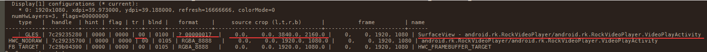
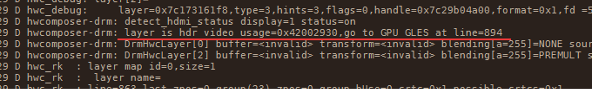

# 4K视频播放卡顿问题分析

**关键词：** **4K、视频播放、卡顿、不流畅**

发布版本：1.0

作者邮箱：bin.li@rock-chips.com

日期：2020.02

文件密级：公开

----

**前言**

本文主要对4K视频卡顿问题进行分析，提供解决该类问题的解决思路及方法。

**读者对象**

本文档主要适用一下工程师：

技术支持工程师

软件开发工程师

**修订记录**

| 日期       | 版本 | 作者 | 修订说明 |
| ---------- | ---- | ---- | -------- |
| 2020-02-25 | V1.0 | 李斌 | 初始版本 |

---

[TOC]

## 适用平台：

| 芯片平台         | Android 版本                    |
| ---------------- | ------------------------------- |
| RK3399           | Android  7.1 / 8.1 / 9.0 / 10.0 |
| RK3288           | Android  7.1 / 8.1 / 9.0 / 10.0 |
| RK3368           | Android  7.1 / 8.1 / 9.0 / 10.0 |
| RK3328 / RK3228H | Android  8.1 / 9.0 / 10.0       |
| RK3326 / PX30    | Android  8.1 / 9.0 / 10.0       |
| RK3126c          | Android 8.1 / 9.0 / 10.0        |


## 分析卡顿原因：

视频卡顿对于显示框架而言，归咎问题原因基本只有一个：

​	视频层没有通过 **Vop** 硬件直接输出到屏幕，此 Vop硬件输出的方法我们称之为 “Overlay”

视频由解码输出，直接通过Vop硬件输出到屏幕上，相比于其他显示合成方式（ GPU / RGA ）效率更高，系统开销更低，那么表现而言就是视频帧率更高，更加流畅。

Overlay 合成方式优点有以下几点：

- 省带宽
- 效率高
- 延时低


而视频层无法Overlay输出的原因，基本取决于硬件 Vop 的支持能力，对于视频而言，硬件需要支持以下能力：

- 视频格式：需要支持输出的视频格式，NV12、YV12等；
- 缩放：视频放大、缩小；
- 旋转：视频方向变换，90度、180度、270度等
- 翻转：水平翻转、垂直翻转
- 偏移：视频需要显示在相对于屏幕原点偏移的任何位置


在RK平台，硬件上存在不少限制导致部分场景无法Overlay视频图层，进而导致视频卡顿，例如：

- RK平台不支持对视频**旋转**、**翻转**，故若需要旋转或翻转视频则硬件无法支持，需要利用其他组件进行转换；
- RK平台不支持对视频图层超过8倍以上的放大与缩小；
- RK平台不支持对视频YV12格式的支持


综上，基本视频卡顿的原因就如上述所说，除此之外，还有其他可能原因导致视频卡顿，比如DDR带宽不够，视频码流过大，解码效率不够等，均有可能导致视频卡顿。


## 调试命令介绍：

- 打印 SurfaceFlinger 服务信息：

```shell
adb shell dumpsys SurfaceFlinger
```

- 打印 Hardware Composer 调试日志：

```shell
//Android 7.1 / 8.1
adb shell setprop sys.hwc.log 511
adb shell logcat 
//Android 9.0 / 10.0
adb shell setprop vendor.hwc.log 511
adb shell logcat
```

- 查看 Vop 配置信息：

```shell
adb shell cat /d/dri/0/summary
```


## 案例分析：

### RK3399-7.1-HDMI输出4K视频播放卡顿

1. 复现卡顿问题场景，抓打印以下日志：

```shell
adb shell dumpsys SurfaceFlinger > sf.log
adb shell "setprop sys.hwc.log 511;logcat -c ;logcat " > hwc.log
```

2. 分析 sf.log 日志，发现如下打印：



可得信息如下：

- SurfaceView为视频层，数据原大小为3840x2160；
- 视频层格式为0x17，查询后确定为 NV12_10，为10bit YUV视频；
- 合成方式为GLES，为GPU合成输出；
- TR 为 00，表明视频无旋转；

**结论：**4K 10bit视频无旋转播放，采用GPU合成输出，存在异常，正常应该是Overlay输出，也就是HWC，所以应该去检查HWC代码逻辑回退GPU合成原因。

3. 分析 hwc.log 日志，发现如下打印：



**发现：**HWC相关逻辑导致该视频层回退GPU处理，所以需要移交HWC模块负责人处理。

**分析log与相关源码可得结论：**RK3399 Vop不支持HDR视频Overlay，所以HWC需要回退GPU，GPU可实现hdr2sdr显示效果，故没有采用Overlay策略显示。

4. 联系客户，客户希望保证帧率达到视频默认帧率，hdr2sdr效果优先级较低，故需要和客户确认代码版本,确认HWC代码版本命令如下：

```shell
//Android 7.1 / 8.1 
adb shell getprop sys.ghwc.commit
adb shell getprop sys.ghwc.version
//Android 9.0 / 10.0
adb shell getprop vendor.ghwc.commit
adb shell getprop vendor.ghwc.version

//客户输出版本如下：
[sys.ghwc.commit]: [commit-id:cc0f345]
[sys.ghwc.version]: [0.28-rk3399-MID]
```

5. HWC同步版本后，修改相关逻辑，采用直接Overlay方式送显视频层，则视频卡顿问题解决。


## 相关Redmine:

- RK3399-7.1-HDMI输出4K视频播放卡顿：

https://redmine.rockchip.com.cn/issues/179655#change-1585243