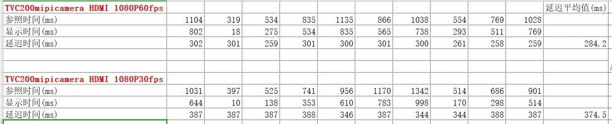
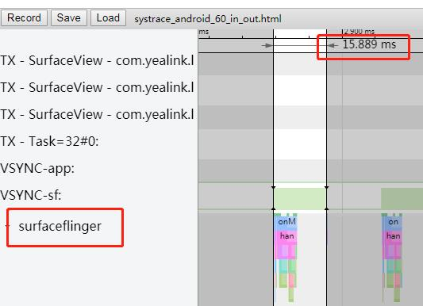
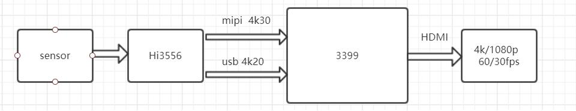
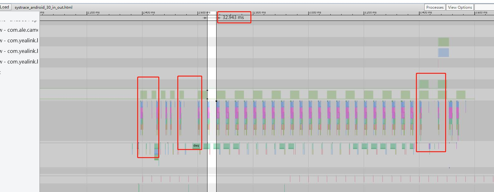
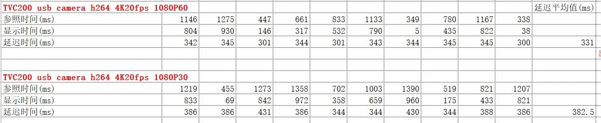

# 显示延迟-Camera码流显示延迟问题分析

文件标识：RK-PC-YF-0002

发布版本：V1.0.0

日期：2020-07-16

文件密级：□绝密   □秘密   □内部资料   ■公开

---

**免责声明**

本文档按“现状”提供，瑞芯微电子股份有限公司（“本公司”，下同）不对本文档的任何陈述、信息和内容的准确性、可靠性、完整性、适销性、特定目的性和非侵权性提供任何明示或暗示的声明或保证。本文档仅作为使用指导的参考。

由于产品版本升级或其他原因，本文档将可能在未经任何通知的情况下，不定期进行更新或修改。

**商标声明**

“Rockchip”、“瑞芯微”、“瑞芯”均为本公司的注册商标，归本公司所有。

本文档可能提及的其他所有注册商标或商标，由其各自拥有者所有。

**版权所有** **© 2019** **瑞芯微电子股份有限公司**

超越合理使用范畴，非经本公司书面许可，任何单位和个人不得擅自摘抄、复制本文档内容的部分或全部，并不得以任何形式传播。

瑞芯微电子股份有限公司

Rockchip Electronics Co., Ltd.

地址：     福建省福州市铜盘路软件园A区18号

网址：     [www.rock-chips.com](http://www.rock-chips.com)

客户服务电话： +86-4007-700-590

客户服务传真： +86-591-83951833

客户服务邮箱： [fae@rock-chips.com](mailto:fae@rock-chips.com)

----

**前言**

本文主以 **Defect #253176** 为例要对 **显示延迟-Camera码流显示延迟问题分析** 进行说明，整理调试流程，整理相关客户Redmine，提供相关工程师调试参考。

**读者对象**

本文档主要适用一下工程师：

技术支持工程师

软件开发工程师

**修订记录**

| 日期       | 版本 | 作者 | 修订说明 |
| ---------- | ---- | ---- | -------- |
| 2020-07-16 | V1.0 | 李斌 | 初始版本 |

**目录**

------

[TOC]

------

**关键词：显示延迟，IPC码流，camera，RK3399，Android 9.0**

## 平台版本

​	适用平台：

| 芯片平台      | Android 版本         |
| ------------- | -------------------- |
| RK3399        | Android 7.1 or above |
| RK3368        | Android 7.1 or above |
| RK3288        | Android 7.1 or above |
| RK3326 / PX30 | Android 8.1 or above |
| RK3328        | Android 8.1 or above |

## 问题描述

客户 Camera App 在HDMI不同刷新率的分辨率下显示延迟程度不同

- 1080p 60帧：显示延迟现象可以接受
- 1080p 30帧：显示延迟现象严重，需要等待一段时间才能将实际的画面显示出来

## 问题分析

1. **设计实验，量化延迟数据：**

   摄像头拍摄秒表，再利用高速摄像机（手机慢动作功能）拍摄实际秒表与摄像头拍摄后显示出来的秒表相减，可能显示总的显示延迟数据，如下图，相减可得显示延迟为 386ms，即可量化延迟数据：

   

2. **统计两个场景的延迟数据（以下亿联数据由产品部毛明康提供）：**

   测量连续10帧的平均延迟数据如下：

   

   可以看到1080p30帧显示延迟平均比1080p60帧多90ms，那么多出的90ms是否正常？

3. **延迟分析：**

   - 显示刷新率降低，HW-Vsync时间增加，送显过程的显示延迟本身就会增加，一帧画面送到屏幕上理论上要经过3个HW-Vsync时间，渲染 \ 送显 \ 屏幕刷帧 各占用一个HW-Vsync时间：

     - 1080p60帧，HW-Vsync时间为 16.6ms * 3 = 49.8ms
     - 1080p30帧，HW-Vsync时间为 33.2ms * 3 = 99.6ms

     可以看到，理论上60帧到30帧切换，显示延迟需要增加49.8ms，这部分是合理的显示延迟增加。我们可以通过设计实验，利用 Systrace 工具测量 **显示->屏幕刷帧** 这一段的耗时，也就是后端显示的耗时：

     - 1080p60帧：

       

     - 1080p30帧：

       

       可以看到显示框架（SurfaceFlinger）均能在一个Vsync时间内完成送显，故理论外的延时增加不在显示框架内，需要朝渲染前端去查看显示延迟问题。

4. **分析完整送显流程：**

    如下系统框图，摄像头数据通过Hi3556采集处理后通过mipi接口送到rk3399，分辨率为4k30p，可选usb辅流，最大可传输4k20p h264码流，系统显示HDMI输出支持4k 30/60p 或1080p 30/60p，如下图：

   

   由 **延迟分析**可得系统显示框架流程无异常，那么剩余的延时耗时可能就存在于 **Hi3556 -> RK3399 -> 显示** 这个流程，通过观察 1080p30帧 systrace 可看到如下情况：

   

   由上图可以看到，Hi3556 过来的视频帧存在不均匀的问题，部分时间没有实际的视频帧送显，也就是说原来10帧的时间内，应用实际只送了9帧到显示框架，若果Hi3556严格按照30帧输入的话，那么应用端必然存在视频帧队列堆积现象，那么此队列堆积也同样会导致显示延迟的增加。

   为了验证此问题，我们可以将Hi3556切换到usb辅流，也就是输出降低到20帧，也就是说，哪怕存在帧来不及送显的现象，那么在下一次Vsync到来时，也能将堆积的帧送显，统计延迟耗时如下：

   

   可以看到，平均延迟时间接近理论值50ms，故上诉猜想正确。

5. **总结：**

   1080p30帧增加的90ms延迟时间由两部分构成：

   - 1080p60帧到30帧切换，显示延迟需要增加49.8ms，这部分是必须的；
   - 由于送显流程过程存在帧队列堆积现象，导致系统的显示延迟增加，延迟的增加量等于队列堆积的帧数，通常增加的延迟时间为 队列堆积的帧数 * HW-Vsync时间。

## 解决方案

- Defect #253176：https://redmine.rock-chips.com/issues/253176：亿联解决方案：

  解决方法即**如何处理堆积的帧队列：**

  - Hi3556 -> RK3399 流程增加对队列的检测，若存在过多帧队列堆积情况，则进行适当的丢帧；
  - 减少输入码流的帧率，如降低到25帧；

  以上解决方法均需要客户自行设计修改逻辑，RK方面仅提供修改意见。

  

- Defect #182656：https://redmine.rock-chips.com/issues/182656：海康

  海康项目为双屏同显，故HDMI切换到30帧的刷新率时，需要将系统的HW-Vsync时间切换到较低（HDMI30帧）HW-Vsync

  补丁文件位于：[0001-HDMI-connected-HW-Vsync-switch-to-hdmi.patch](patch/hardware/rockchip/hwcomposer/0001-HDMI-connected-HW-Vsync-switch-to-hdmi.patch)

  

- Defect #258100：https://redmine.rock-chips.com/issues/258100：大华

  大华解决方案为提供系统刷新率的获取接口，由应用去控制输入码流帧率，达到降低显示延迟的方案，系统提供属性供客户查询

  补丁文件位于：[rk3399-7.1-set-display-fps-to-property.patch](patch/hardware/rockchip/hwcomposer/rk3399-7.1-set-display-fps-to-property.patch)

## SDK commit

无

##相关Redmine

Defect #253176：https://redmine.rock-chips.com/issues/253176

Defect #182656：https://redmine.rock-chips.com/issues/182656

Defect #258100：https://redmine.rock-chips.com/issues/258100