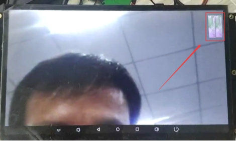
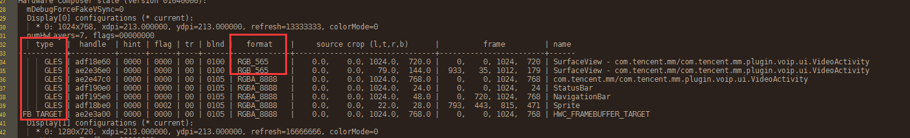
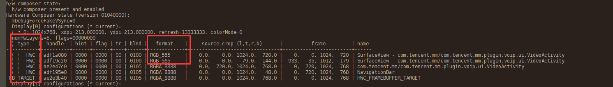
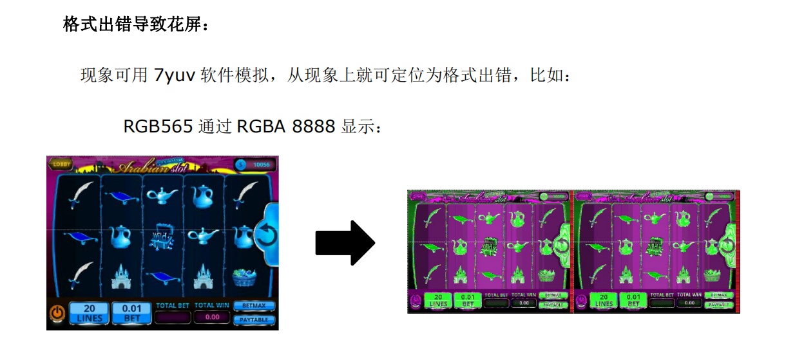
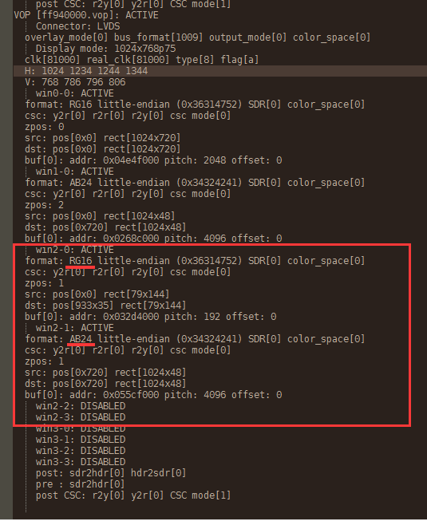
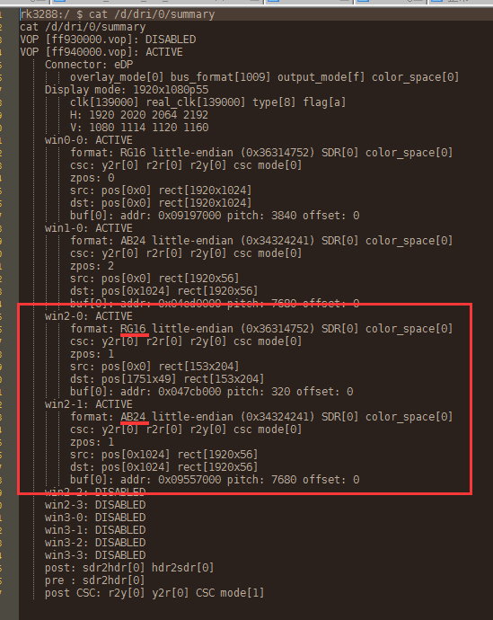

# 多区域格式配置导致显示花屏

**关键词：** **花屏，小区域，多区域配置错误**

发布版本：1.0

作者邮箱：bin.li@rock-chips.com

日期：2020.03

文件密级：公开

----

**前言**

本文主要以 Defect #238911 问题为例，对多区域格式配置导致显示花屏的问题进行分析

**读者对象**

本文档主要适用一下工程师：

技术支持工程师

软件开发工程师

**修订记录**

| 日期       | 版本 | 作者 | 修订说明 |
| ---------- | ---- | ---- | -------- |
| 2020-03-06 | V1.0 | 李斌 | 初始版本 |

---

[TOC]


## 问题描述：

微信视频对话，右上角小窗口出现花屏现象，现象如下：




## 问题平台：

根本原因为 RK3288 / RK3326 多区域不支持不同的图像格式，

| 芯片平台 | Android 平台                   |
| -------- | ------------------------------ |
| RK3288   | Android 7.1 / 8.1 / 9.0 / 10.0 |
| RK3326   | Android 8.1 / 9.0 / 10.0       |


## 问题分析步骤：

1. 尝试关闭HWC，查看问题是否复现：

```shell
// Android 8.1 及以下版本：
adb shell setprop sys.hwc.compose_policy 0
adb shell setprop sys.hwc.enable 0

// Android 9.0 及以上版本：
adb shell setprop vendor.hwc.compose_policy 0
adb shell setprop vendor.hwc.enable 0
```


2. 复现问题后抓打印以下log:

```
// Android 8.1 及以下版本：
// 复现问题，需要将 正常->异常 完整的过程都抓打印下来：
adb shell setprop sys.hwc.log 511;logcat -c ;logcat > hwc.log
// 正常情况与异常情况分别打印以下log，提供分析：
adb shell cat /d/dri/0/summary > summary.log
adb shell dumpsys SurfaceFlinger > sf.log

// Android 9.0 及以上版本：
adb shell setprop vendor.hwc.log 511;logcat -c ;logcat > hwc.log
// 正常情况与异常情况分别打印以下log，提供分析：
adb shell cat /d/dri/0/summary > summary.log
adb shell dumpsys SurfaceFlinger > sf.log
```


3. 分析相关log，重点查看 summary.log
4. 提供补丁，验证问题。


## 案例分析 - Defect #238911：

Redmine 41# 提供的日志，可以提供以下信息：

1. **SurfaceFlinger 日志分析：**

正常显示日志如下：




异常显示日志如下：



可以得到以下结论：

- GLES合成问题无法复现，HWC合成问题复现，即关闭HWC问题无法复现
- 问题图层格式为 RGB565，并且从现象来看，极有可能是由于 RGB565 格式以 RGBA8888格式显示（如下如）：




2. **summary.log 日志分析：**

异常日志：



可得结论：

- Win2-0 配置格式为 RG16 即 RGB565
- Win2-1 配置格式为 RGB24即 RGBA8888


故问题定位为 **多区域格式配置导致显示花屏**


## 案例分析 - Defect #223454：

异常summary.log ，也发现同样问题：




## 补丁说明：

请在  hardware/rockchip/hwcomposer 目录以下补丁：

0001-RK3288-RK3326-multi-region-format-must-be-the-same.patch


## 相关Redmine:

- Defect #238911：https://redmine.rockchip.com.cn/issues/238911

​		微信视频右上角小窗口图像花屏

- Defect #223454：https://redmine.rockchip.com.cn/issues/223454

  RK3288 Android7.1 微信与pc视屏通话会死机


