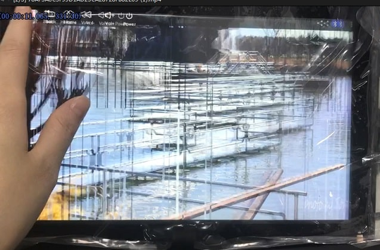

# 显示抖动-RK3326显示多层1080p图层出现抖动

文件标识：RK-PC-YF-0002

发布版本：V1.0.0

日期：2020-06-24

文件密级：□绝密   □秘密   □内部资料   ■公开

---

**免责声明**

本文档按“现状”提供，瑞芯微电子股份有限公司（“本公司”，下同）不对本文档的任何陈述、信息和内容的准确性、可靠性、完整性、适销性、特定目的性和非侵权性提供任何明示或暗示的声明或保证。本文档仅作为使用指导的参考。

由于产品版本升级或其他原因，本文档将可能在未经任何通知的情况下，不定期进行更新或修改。

**商标声明**

“Rockchip”、“瑞芯微”、“瑞芯”均为本公司的注册商标，归本公司所有。

本文档可能提及的其他所有注册商标或商标，由其各自拥有者所有。

**版权所有** **© 2019** **瑞芯微电子股份有限公司**

超越合理使用范畴，非经本公司书面许可，任何单位和个人不得擅自摘抄、复制本文档内容的部分或全部，并不得以任何形式传播。

瑞芯微电子股份有限公司

Rockchip Electronics Co., Ltd.

地址：     福建省福州市铜盘路软件园A区18号

网址：     [www.rock-chips.com](http://www.rock-chips.com)

客户服务电话： +86-4007-700-590

客户服务传真： +86-591-83951833

客户服务邮箱： [fae@rock-chips.com](mailto:fae@rock-chips.com)

----

**前言**

本文以 **Defect #256905** 为例主要对 **RK3326显示多层1080p图层出现抖动** 进行说明，整理调试流程，整理相关客户Redmine，提供相关工程师调试参考。

**读者对象**

本文档主要适用一下工程师：

技术支持工程师

软件开发工程师

**修订记录**

| 日期       | 版本 | 作者 | 修订说明 |
| ---------- | ---- | ---- | -------- |
| 2020-06-24 | V1.0 | 李斌 | 初始版本 |

**目录**

------

[TOC]

------

**关键词：显示抖动，闪黑条，闪绿条，RK3326**

## 平台版本

​	适用平台：

| 芯片平台      | Android 版本         |
| ------------- | -------------------- |
| RK3326 / PX30 | Android 8.1 or above |

## 问题描述

客户在目标场景出现闪条纹的抖动问题，现象如下，详情请参考Defect #256905提供的现象视频：



并且串口伴随以下日志输出：

```shell
[  361.084769] rockchip-vop ff460000.vop: [drm:vop_isr] *ERROR* POST_BUF_EMPTY irq err
[  370.557633] rockchip-vop ff460000.vop: [drm:vop_isr] *ERROR* POST_BUF_EMPTY irq err
[  370.557775] rockchip-vop ff460000.vop: [drm:vop_isr] *ERROR* POST_BUF_EMPTY irq err
[  370.690141] rockchip-vop ff460000.vop: [drm:vop_isr] *ERROR* POST_BUF_EMPTY irq err
[  370.690915] rockchip-vop ff460000.vop: [drm:vop_isr] *ERROR* POST_BUF_EMPTY irq err
[  370.690997] rockchip-vop ff460000.vop: [drm:vop_isr] *ERROR* POST_BUF_EMPTY irq err
[  370.691125] rockchip-vop ff460000.vop: [drm:vop_isr] *ERROR* POST_BUF_EMPTY irq err
[  370.691149] rockchip-vop ff460000.vop: [drm:vop_isr] *ERROR* POST_BUF_EMPTY irq err
[  370.691167] rockchip-vop ff460000.vop: [drm:vop_isr] *ERROR* POST_BUF_EMPTY irq err
```


## 问题分析

1. **串口报错日志语义：**POST_BUF_EMPTY irq err

   语义：VOP 中断触发时，发现无法从DDR读到图像源数据，则会输出该报错；

2. **现象分析：**

   由Defect #256905提供的现象视频可以看到画面出现撕裂、黑线，并且整体向右平移抖动，观察到的竖向黑线，可以理解为VOP无法从DDR读取到图像源数据，故输出脏数据（可能为空，也可能是其他数据），而实际该行的数据被delay到下一行输出，导致整体的画面向右边移动，造成画面撕裂与画面抖动；

3. **结论：**

   由于VOP无法及时从DDR读取图像源数据导致的问题，故问题与DDR的负载能力相关，与VOP读DDR带宽能力相关，解决此问题有三种方法：

   - DDR提频：增加DDR负载能力
   - VOP提频：增加VOP读DDR速率
   - 减少Vop硬件图层使能：降低VOP读DDR的数据量


## 解决方案

1. **DDR提频：**尝试将DDR定频最高频，查看问题是否还能复现，若还能复现，则考虑后续办法

   风险：增加系统整机功耗

2. **VOP提频：**尝试将vop_aclk提频，查看是否还能复现问题，若还能复现，则考虑后续办法

   风险：增加系统整机功耗

   ```diff
   // kernel 目录
   --- a/arch/arm64/boot/dts/rockchip/px30.dtsi
   +++ b/arch/arm64/boot/dts/rockchip/px30.dtsi
   @ -1498,6 +1498,9 @
   iommus = <&vopb_mmu>;
   status = "disabled";
   
   + assigned-clocks = <&cru ACLK_VOPB>;
   + assigned-clock-rates = <400000000>;
   ```

   

3. **减少Vop硬件图层使能：**强制关闭硬件图层，以降低VOP端的读负载，

   风险：此方法优先级很低，因为关闭部分硬件加速图层，可能会导致部分场景出现卡顿，不流畅等问题，部分场景会增加系统功耗，实在没有其他办法的情况下考虑此方法

   补丁目录：[fhd_screen_tear_on_rk3326.patch](patch/hardware/rockchip/hwcomposer)

   请在 hardware/rockchip/hwcomposer 目录打上附件补丁

   

## SDK commit

减少Vop硬件图层使能的方法由于可能会影响系统性能，并且该问题仅出现在极个别客户场景，故暂未提交内部SDK，仅以补丁提供。


##相关Redmine

Defect #256905：https://redmine.rock-chips.com/issues/256905

Defect #225167：https://redmine.rock-chips.com/issues/225167