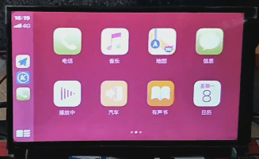

# 视频-显示异常-色彩空间设置导致显示偏红

文件标识：RK-PC-YF-0002

发布版本：V1.0.0

日期：2020-06-05

文件密级：□绝密   □秘密   □内部资料   ■公开

---

**免责声明**

本文档按“现状”提供，瑞芯微电子股份有限公司（“本公司”，下同）不对本文档的任何陈述、信息和内容的准确性、可靠性、完整性、适销性、特定目的性和非侵权性提供任何明示或暗示的声明或保证。本文档仅作为使用指导的参考。

由于产品版本升级或其他原因，本文档将可能在未经任何通知的情况下，不定期进行更新或修改。

**商标声明**

“Rockchip”、“瑞芯微”、“瑞芯”均为本公司的注册商标，归本公司所有。

本文档可能提及的其他所有注册商标或商标，由其各自拥有者所有。

**版权所有** **© 2019** **瑞芯微电子股份有限公司**

超越合理使用范畴，非经本公司书面许可，任何单位和个人不得擅自摘抄、复制本文档内容的部分或全部，并不得以任何形式传播。

瑞芯微电子股份有限公司

Rockchip Electronics Co., Ltd.

地址：     福建省福州市铜盘路软件园A区18号

网址：     [www.rock-chips.com](http://www.rock-chips.com)

客户服务电话： +86-4007-700-590

客户服务传真： +86-591-83951833

客户服务邮箱： [fae@rock-chips.com](mailto:fae@rock-chips.com)

----

**前言**

本文主要以 **Defect #255877** 为例对 **视频的色彩空间设置导致视频显示偏红的问题** 进行说明，整理调试流程，整理相关客户Redmine，提供相关工程师调试参考。

**读者对象**

本文档主要适用一下工程师：

技术支持工程师

软件开发工程师

**修订记录**

| 日期       | 版本 | 作者 | 修订说明 |
| ---------- | ---- | ---- | -------- |
| 2020-06-05 | V1.0 | 李斌 | 初始版本 |

**目录**

------

[TOC]

------

**关键词：视频播放、colorspace、显示偏红、HWC、DRM**

## 平台版本

​	适用平台：

| 芯片平台      | Android 版本         |
| ------------- | -------------------- |
| RK3399        | Android 7.1 or above |
| RK3368        | Android 7.1 or above |
| RK3288        | Android 7.1 or above |
| RK3326 / PX30 | Android 8.1 or above |
| RK3328        | Android 8.1 or above |

## 问题描述

RK3399-10.0 客户更新最新HWC版本后，出现主界面滑动色彩偏红的问题，现象如下：



进入主界面后，静态桌面显示正常，滑动桌面的情况下颜色显示偏红，如上图，正常显示情况如下图：


复现问题关键信息：

- HWC 启动的情况下，静态桌面色彩恢复正常，滑动桌面复现色彩偏红异常
- HWC关闭的情况下采用GPU合成，则无法复现问题

## 问题分析

​	**1.分析现象：**

- 关闭HWC与静态桌面，系统合成均采用GPU合成，输出RGBA格式数据，则无法复现问题；
- 色彩偏红现象是应用渲染出错的可能性比较小，并且与实际的后端合成方式有关，基本可以排除应用问题；
- 整体颜色虽然偏红，但是还能分辨出其他颜色（绿色，黄色），显示格式设置错误有可能，但不大；
- 更新HWC版本后才出现问题，可以对比版本修改，是否有相关的修改导致问题

​	**2.指导客户打印相关Log:**  

```
//建议客户在复现问题的条件下，打印以下日志：
1.adb shell setprop sys.hwc.log 511;logcat -c ;logcat > hwc.log
2.adb shell cat /d/dri/0/summary > summary.log
```

​	**3.分析Log:** 

```c++
// hwc.log
D hwc_debug: layer[0]=SurfaceView - ..iew.SplashActivity#0
D hwc_debug:   layer=0x7f5060..,format=0x15,fd =80,transform=0x0,blend=0x100,..
// 可以发现当前场景数据格式为YUV，并且采用的是Overlay策略，即可说明问题VOP overlay YUV格式才可以复现

// summary.log
    win0-0: ACTIVE
    	// 视频格式,并且 colorspace 被设置为7
        format: NV12 little-endian (0x3231564e) SDR[0] color_space[7]  // 
        csc: y2r[1] r2r[0] r2y[0] csc mode[2]
        zpos: 1
        src: pos[0x0] rect[1024x592]
        dst: pos[0x0] rect[1024x600]
        buf[0]: addr: 0x0000000003eb3000 pitch: 1024 offset: 0
        buf[1]: addr: 0x0000000003eb3000 pitch: 1024 offset: 606208
// colorspace=7，即 colorspace=V4L2_COLORSPACE_JPEG 存在显示异常的可能
```

​	**4.设计实验，复现问题：**

```diff
// 在HWC设置colorspace 处设置属性，强行修改colorspace值，查看是否可以复现问题
diff --git a/hwcomposer.cpp b/hwcomposer.cpp
index e8e8a0d..1005341 100755
--- a/hwcomposer.cpp
+++ b/hwcomposer.cpp
@@ -1205,6 +1205,9 @@ int DrmHwcLayer::InitFromHwcLayer(struct hwc_context_t *ctx, int display, hwc_la
             {
                 colorspace = V4L2_COLORSPACE_DEFAULT;
             }
+            char value[PROPERTY_VALUE_MAX];
+            property_get("debug.lb", value, "0");
+            colorspace = atoi(value);
             eotf = TRADITIONAL_GAMMA_SDR;
         }else{
             colorspace = V4L2_COLORSPACE_DEFAULT;
```

​	经过上述实验，发现设置以下colorspace后，播放视频复现颜色偏红问题的情况：

| Colorspace                    | 备注                                  | 复现问题？ |
| ----------------------------- | ------------------------------------- | ---------- |
| V4L2_COLORSPACE_DEFAULT = 0   | 默认colorspace                        | N          |
| V4L2_COLORSPACE_SMPTE170M     | 用于广播NTSC / PAL SDTV               | Y          |
| V4L2_COLORSPACE_SMPTE240M     | 已过时，由REC709取代                  | Y          |
| V4L2_COLORSPACE_REC709        | Rec.709：用于高清电视                 | N          |
| V4L2_COLORSPACE_BT878         | 不推荐使用，请勿使用                  | Y          |
| V4L2_COLORSPACE_470_SYSTEM_M  | NTSC 1953色彩空间，被SMPTE 170M取代。 | Y          |
| V4L2_COLORSPACE_470_SYSTEM_BG | 被SMPTE 170M取代                      | Y          |
| V4L2_COLORSPACE_JPEG          | sRGB，ENC601，Full range简写          | Y          |
| V4L2_COLORSPACE_SRGB          | 适用于RGB色彩空间                     | Y          |
| V4L2_COLORSPACE_ADOBERGB      | AdobeRGB colorspace                   | Y          |
| V4L2_COLORSPACE_BT2020        | BT.2020 色彩空间, 用于超高清电视      | N          |
| V4L2_COLORSPACE_RAW           | 原始色彩空间：用于RAW未处理的图像     | Y          |
| V4L2_COLORSPACE_DCI_P3        | 电影放映机使用的色彩空间              | Y          |

​	好，那么问题就定位为 colorspace 导致颜色偏红，问题定位。

## 解决方案

确定问题为colorspace设置为V4L2_COLORSPACE_JPEG导致偏红现象，咨询底层平台黄家钗发现目前Kernel对 V4L2_COLORSPACE_JPEG colorspace处理流程存在异常，该异常导致了显示颜色偏红的问题，故黄家钗提供以下补丁处理该异常：

补丁文件地址：[aa2f0fb.diff.zip](patch/kernel)

打上补丁后，对解码配置的colorspace支持情况如下：

| 解码配置Colorspace            | 底层配置Colorspace | 支持情况 |
| ----------------------------- | ------------------ | -------- |
| V4L2_COLORSPACE_DEFAULT = 0   | bt709 limit        | Y        |
| V4L2_COLORSPACE_SMPTE170M     | bt601 limit        | Y        |
| V4L2_COLORSPACE_SMPTE240M     | bt709 limit        | Y        |
| V4L2_COLORSPACE_REC709        | bt709 limit        | Y        |
| V4L2_COLORSPACE_BT878         | none               | N        |
| V4L2_COLORSPACE_470_SYSTEM_M  | bt601 limit        | Y        |
| V4L2_COLORSPACE_470_SYSTEM_BG | bt601 limit        | Y        |
| V4L2_COLORSPACE_JPEG          | bt601 full         | Y        |
| V4L2_COLORSPACE_SRGB          | none               | N        |
| V4L2_COLORSPACE_ADOBERGB      | none               | N        |
| V4L2_COLORSPACE_BT2020        | bt2020             | Y        |
| V4L2_COLORSPACE_RAW           | none               | N        |
| V4L2_COLORSPACE_DCI_P3        | none               | N        |

其余不支持的colorspace基本不会在平台上出现，若出现的话，系统可能会显示异常，这点需要注意一下。


## SDK commit

该补丁目前已提交内部分支：

```
仓库：	rk/kernel
分支：	develop-4.19
From aa2f0fbf60fe860bfa5476f6f5cef844a4f43601 Mon Sep 17 00:00:00 2001
From: Sandy Huang <hjc@rock-chips.com>
Date: Tue, 23 Jun 2020 17:18:02 +0800
Subject: [PATCH] drm/rockchip: rk3399 vop: add support more color space

add support following color space:
    V4L2_COLORSPACE_SMPTE240M
    V4L2_COLORSPACE_470_SYSTEM_M
    V4L2_COLORSPACE_470_SYSTEM_BG

now can support following color space:
bt601 limit:
    V4L2_COLORSPACE_SMPTE170M
    V4L2_COLORSPACE_470_SYSTEM_M
    V4L2_COLORSPACE_470_SYSTEM_BG
bt601 full:
    V4L2_COLORSPACE_JPEG
bt709 limit:
    V4L2_COLORSPACE_SMPTE240M
    V4L2_COLORSPACE_REC709
    V4L2_COLORSPACE_DEFAULT
bt2020:
    V4L2_COLORSPACE_BT2020

Change-Id: I851b7aa9959f69efdd8bad3371395b2fceacc31a
Signed-off-by: Sandy Huang <hjc@rock-chips.com>
```


##相关Redmine

Defect #255877： https://redmine.rock-chips.com/issues/255877

Support #257659：https://redmine.rock-chips.com/issues/257659

Defect #260490：https://redmine.rock-chips.com/issues/260490