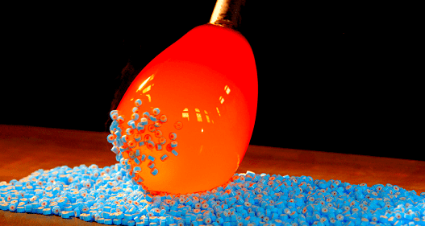
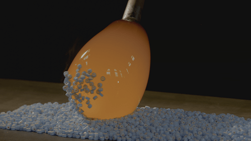

# 视频-HDR-显示效果与视频流畅相关问题

文件标识：RK-PC-YF-0002

发布版本：V1.0.0

日期：2020-06-05

文件密级：□绝密   □秘密   □内部资料   ■公开

---

**免责声明**

本文档按“现状”提供，瑞芯微电子股份有限公司（“本公司”，下同）不对本文档的任何陈述、信息和内容的准确性、可靠性、完整性、适销性、特定目的性和非侵权性提供任何明示或暗示的声明或保证。本文档仅作为使用指导的参考。

由于产品版本升级或其他原因，本文档将可能在未经任何通知的情况下，不定期进行更新或修改。

**商标声明**

“Rockchip”、“瑞芯微”、“瑞芯”均为本公司的注册商标，归本公司所有。

本文档可能提及的其他所有注册商标或商标，由其各自拥有者所有。

**版权所有** **© 2019** **瑞芯微电子股份有限公司**

超越合理使用范畴，非经本公司书面许可，任何单位和个人不得擅自摘抄、复制本文档内容的部分或全部，并不得以任何形式传播。

瑞芯微电子股份有限公司

Rockchip Electronics Co., Ltd.

地址：     福建省福州市铜盘路软件园A区18号

网址：     [www.rock-chips.com](http://www.rock-chips.com)

客户服务电话： +86-4007-700-590

客户服务传真： +86-591-83951833

客户服务邮箱： [fae@rock-chips.com](mailto:fae@rock-chips.com)

----

**前言**

本文主要以 **Defect #254008** 为例对 **HDR视频在SDR电视的显示效果与流畅度取舍问题上** 进行说明，整理调试流程，整理相关客户Redmine，提供相关工程师调试参考。

**读者对象**

本文档主要适用一下工程师：

技术支持工程师

软件开发工程师

**修订记录**

| 日期       | 版本 | 作者 | 修订说明 |
| ---------- | ---- | ---- | -------- |
| 2020-06-05 | V1.0 | 李斌 | 初始版本 |

**目录**

------

[TOC]

------

**关键词：HDR、视频播放、SDR电视、HWC、DRM**

## 平台版本

​	适用平台：

| 芯片平台 | Android 版本         |
| -------- | -------------------- |
| RK3399   | Android 7.1 or above |
| RK3368   | Android 7.1 or above |
| RK3288   | Android 7.1 or above |
| RK3328   | Android 8.1 or above |


## 问题描述

客户RK3399-10.0平台播放HDR视频发现如下现象：

- Android 10.0 HDMI显示器支持HDR，视频显示效果正常；
- Android 10.0 HDMI显示器不支持HDR，视频显示效果异常，并且LVDS屏幕显示也异常；

- Android 7.1 HDMI显示器支持HDR，视频显示效果正常；
- Android 7.1 HDMI显示器不支持HDR，视频显示效果正常，并且LVDS屏幕显示也正常；

HDR正常显示效果如下：



HDR异常显示效果如下：



## 问题分析

​	**1.分析现象：**

- Android 7.1 与 Android 10.0 HWC 代码是一套，故可以怀疑HWC的代码版本差异导致现象差异
- RK3399 Vop 硬件不支持HDR2SDR，如果需要在SDR上呈现HDR的效果那么必须由GPU实现HDR2SDR，故怀疑Android 7.1 实现的HDR效果来自于GPU的HDR2SDR处理

​	**2.指导客户打印相关Log:**  

```
// 建议客户在复现问题的条件下，打印以下日志：
// Android 10.0
1.adb shell setprop vendor.hwc.log 511;logcat -c ;logcat > hwc.log
2.adb shell cat /d/dri/0/summary > summary.log

// Android 7.1
1.adb shell setprop sys.hwc.log 511;logcat -c ;logcat > hwc.log
2.adb shell cat /d/dri/0/summary > summary.log
```

​	**3.分析Log:** 

```c++
// hwc.log Android 7.1
D hwcomposer-drm: layer is hdr video,go to GPU GLES at line=962
// Android 7.1 HDR视频由GPU处理，从显示效果上说明存在GPU实现HDR2SDR的功能
    
// hwc.log Android 10.0
// Android 10.0 视频直接通过Vop送显示，没有HDR2SDR的过程，故没有显示效果
```

​	**4.结论：**

- Android 10.0 对于HDR视频处理直接走Overlay，这种显示通路会导致HDR异常显示的效果；
- Android 7.1 对于HDR视频处理走GLES，也就是利用GPU实现HDR2SDR的效果，达到HDR显示正常的效果。

故目前对于HDR视频在SDR电视上显示存在两种处理方案，两种方案的优缺点如下：

- **HDR视频直接Overlay：**
  - 优点：视频可实现点对点显示，画面比较细腻清晰；
  - 优点：视频帧率可以保证在60帧；
  - 缺点：无HDR显示效果，视频画面偏白，如上图HDR显示异常效果。
- **HDR视频通过GLES实现HDR2SDR：**
  - 优点：视频显示效果较好，如上图HDR显示正常效果；
  - 缺点：视频无法实现点对点显示，因为调用GLES过程中通常存在缩放，输出视频分辨率为屏幕UI分辨率；
  - 缺点：视频帧率较低，由于HDR2SDR处理过程中系统开销比较大，导致视频帧率至多30帧。

## 解决方案

由于上诉两种方案不同的客户有不同的考量，故系统提供以下属性来进行方案切换，可根据客户实际的情况进行选择：

- **HDR视频直接Overlay:**

```
// Android 7.1 / 8.1
sys.hwc.hdr_video_by_gles=false (缺省值)
// Android 9.0 and above
vendor.hwc.hdr_video_by_gles=false (缺省值)
```

- **HDR视频通过GLES实现HDR2SDR：**

```
// Android 7.1 / 8.1
sys.hwc.hdr_video_by_gles=true
// Android 9.0 and above
vendor.hwc.hdr_video_by_gles=true

// Android 10.0 还需要添加以下属性来打开GLES HDR2SDR功能：
ro.surface_flinger.has_HDR_display=true
```

请在hardware/rockchip/hwcomposer目录打上以下补丁文件，提供上述属性支持：

[补丁文件链接](patch/hardware/rockchip/hwcomposer)

## SDK commit

该修改已经合并内部开发分支，通过查询属性的方法查询版本号，相关命令如下：

```
adb shell getprop | grep ghwc.version
```

| 芯片平台      | 至少更新至以下版本才支持该补丁 |
| ------------- | ------------------------------ |
| RK3399        | 0.64                           |
| RK3368        | 0.64                           |
| RK3288        | 0.64                           |
| RK3326 / PX30 | 0.64                           |
| RK3328        | 0.64                           |

相关commit message信息如下：

```
仓库路径：hardware/rockchip/hwcomposer
分支：rk33/mid/6.0/develop_drm

commit 2d4a1668784d463f040c85bc02e0e7ae80d0e4d4
Author: libin <bin.li@rock-chips.com>
Date:   Wed Jun 10 14:15:15 2020 +0800

    Add property to choose the compose way about hdr video.
    
    Android 7.1 / 8.1 : sys.hwc.hdr_video_by_gles
    Android 9.0 and above : vendor.hwc.hdr_video_by_gles
    
      true : hdr video is composed by gles.
      false: hdr video is composed by overlay.
    
    Bug:
        Defect #254008
    
    Change-Id: Ide2957ffbe475154b9030a377b128702a0392c0f
    Signed-off-by: libin <bin.li@rock-chips.com>
```


##相关Redmine

Defect #254008： https://redmine.rock-chips.com/issues/254008
