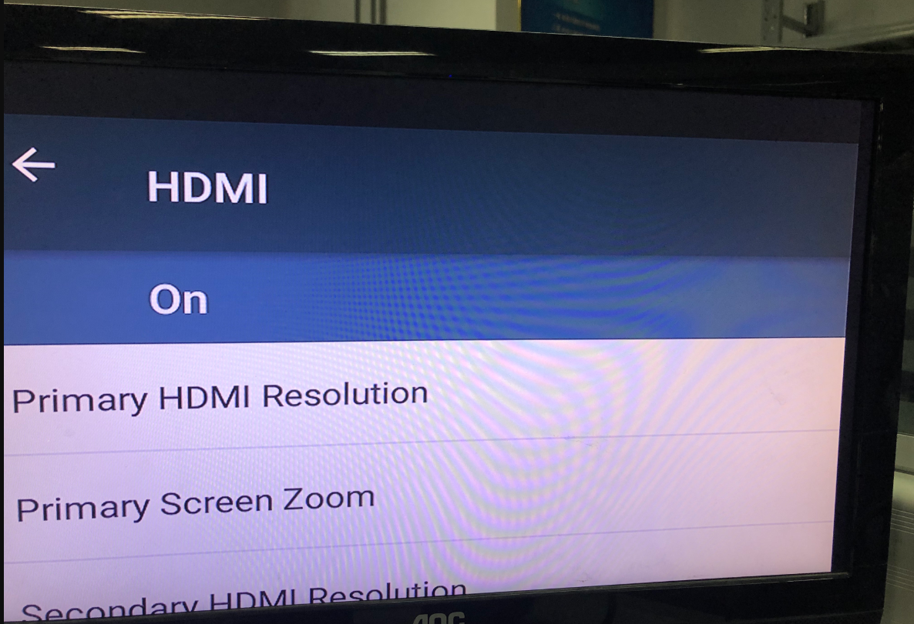

# HDMI-主屏热插拔-副屏显示不全

文件标识：RK-PC-YF-0002

发布版本：V1.2.0

日期：2020-06-05

文件密级：□绝密   □秘密   □内部资料   ■公开

---

**免责声明**

本文档按“现状”提供，瑞芯微电子股份有限公司（“本公司”，下同）不对本文档的任何陈述、信息和内容的准确性、可靠性、完整性、适销性、特定目的性和非侵权性提供任何明示或暗示的声明或保证。本文档仅作为使用指导的参考。

由于产品版本升级或其他原因，本文档将可能在未经任何通知的情况下，不定期进行更新或修改。

**商标声明**

“Rockchip”、“瑞芯微”、“瑞芯”均为本公司的注册商标，归本公司所有。

本文档可能提及的其他所有注册商标或商标，由其各自拥有者所有。

**版权所有** **© 2019** **瑞芯微电子股份有限公司**

超越合理使用范畴，非经本公司书面许可，任何单位和个人不得擅自摘抄、复制本文档内容的部分或全部，并不得以任何形式传播。

瑞芯微电子股份有限公司

Rockchip Electronics Co., Ltd.

地址：     福建省福州市铜盘路软件园A区18号

网址：     [www.rock-chips.com](http://www.rock-chips.com)

客户服务电话： +86-4007-700-590

客户服务传真： +86-591-83951833

客户服务邮箱： [fae@rock-chips.com](

----

**前言**

本文主要对 **插拔主屏HDMI-副屏显示异常问题**，以 Defect #221917 为例进行说明，整理调试流程，整理相关客户Redmine.

**读者对象**

本文档主要适用一下工程师：

技术支持工程师

软件开发工程师

**修订记录**

| 日期       | 版本   | 作者 | 修订说明           |
| ---------- | ------ | ---- | ------------------ |
| 2020-03-11 | V1.0.0 | 李斌 | 初始版本           |
| 2020-03-19 | V1.1.0 | 李斌 | 添加Redmine 244758 |
| 2020-06-05 | V1.2.0 | 李斌 | 修改补丁文件       |

**目录**

------

[TOC]

------

**关键词：RK3399、HDMI插拔、显示异常**

## 平台版本：

​	适用平台：

| 芯片平台      | Android 版本         |
| ------------- | -------------------- |
| RK3399        | Android 7.1 or above |
| RK3368        | Android 7.1 or above |
| RK3288        | Android 7.1 or above |
| RK3326 / PX30 | Android 8.1 or above |
| RK3328        | Android 8.1 or above |


## 问题描述：

以 Defect #221917 为例：

主屏幕原始分辨率为1920x1080p，副屏幕原始分辨率为1920x1080p60；

1. 调整副屏幕为720x480p59后，插拔主屏幕线，副屏幕画面放大，现象如下：



2. 调整副屏幕为1920x1080p60后，插拔主屏幕线，副屏幕画面恢复原样；


## 问题分析：

​	**1.分析现象：**

​	从现象上看，完整图像的左上半部分被显示在整个屏幕上，与客户描述现象基本一致，那么就要从相关log上去解释为什么会导致这个现象。

​	**2.指导客户打印相关Log:**

> ```c++
>       //主副屏都插着，且均设置为 1080P，此时画面应该显示正常，然后上传以下log:
>       1.adb shell getprop > getprop.log
>       2.adb shell setprop sys.hwc.log 511;logcat -c ;logcat > hwc.log
>       3.adb shell dumpsys SurfaceFlinger > sf.log
>       4.adb shell cat /d/dri/0/summary > summary.log
>
>       //复现异常情况后，可能有分辨率切换或者，插拔行为，也同样抓打印以下log:
>       1.adb shell getprop > getprop.log
>       2.adb shell setprop sys.hwc.log 511;logcat -c ;logcat > hwc.log
>       3.adb shell dumpsys SurfaceFlinger > sf.log
>       4.adb shell cat /d/dri/0/summary > summary.log
>
> ```

​	**3.分析Log:**

​	对比正常与异常的 summary.log ，可以很容易的就查看到一个问题，异常log如下：

```c++
    VOP [ff8f0000.vop]: ACTIVE
        Connector: DP
        overlay_mode[0] bus_format[100a] output_mode[0] color_space[0]
        Display mode: 720x576p50
        clk[27000] real_clk[27000] type[40] flag[a]
        H: 720 732 796 864
        V: 576 581 586 625
        win0-0: ACTIVE
        format: AB24 little-endian (0x34324241) SDR[0] color_space[0]
        csc: y2r[0] r2r[0] r2y[0] csc mode[0]
        zpos: 0
        src: pos[0x0] rect[720x576]  //参数异常
        dst: pos[0x0] rect[720x576]
        buf[0]: addr: 0x0000000009ecb000 pitch: 7680 offset: 0
        win2-0: ACTIVE
        format: AB24 little-endian (0x34324241) SDR[0] color_space[0]
        csc: y2r[0] r2r[0] r2y[0] csc mode[0]
        zpos: 1
        src: pos[0x0] rect[720x36]  //参数异常
        dst: pos[0x0] rect[720x36]
        buf[0]: addr: 0x0000000007e8d000 pitch: 7680 offset: 0
        win2-1: DISABLED
        format: AB24 little-endian (0x34324241) SDR[0] color_space[0]
        csc: y2r[0] r2r[0] r2y[0] csc mode[0]
        zpos: 1
        src: pos[0x0] rect[720x-433]    //参数异常
        dst: pos[0x1009] rect[720x-433] //参数异常
        buf[0]: addr: 0x0000000007f57000 pitch: 7680 offset: 0
        win2-2: DISABLED
        format: AB24 little-endian (0x34324241) SDR[0] color_space[0]
        csc: y2r[0] r2r[0] r2y[0] csc mode[0]
        zpos: 1
        src: pos[0x0] rect[-680x-36]      //参数异常
        dst: pos[1400x612] rect[-680x-36] //参数异常
        buf[0]: addr: 0x0000000004537000 pitch: 192 offset: 0
        win2-3: DISABLED
        post: sdr2hdr[0] hdr2sdr[0]
        pre : sdr2hdr[0]
        post CSC: r2y[0] y2r[0] CSC mode[1]
```

​	可以看到，几乎所有的src参数均出现异常，并且部分图层dst参数也存在异常，由于是双屏同显，主屏的src参数为1920x1080( 查看redmine #18  summary正常.log )，而作为双屏同显，副屏的原参数如果不经过副屏的GPU合成输出的话，src也应该是1920x1080，而此图层设置为720x576必然存在问题，而此行为又与主屏的热插拔行为相关，故可以将问题收敛为主屏热插拔相关行为导致的副屏显示参数异常。

​	**4.定位问题：**

​	查看HWC 热插拔处理相关流程代码，发现存在以下问题：

	1. HWC在处理主屏热插拔事件过程中，会去更新副屏的 framebuffer_width / framebuffer_height 参数，代码如下，HWC 向SurfaceFlinger 注册的设备分辨率为 1920x1080，经过此操作后，HWC 认为向SurfaceFlinger注册的设备分辨率为720x576，那么在缩放因子上就会计算错误：

```c++
hd->framebuffer_width = mode.h_display();
hd->framebuffer_height = mode.v_display();
hd->vrefresh = mode.v_refresh();
```

	2. 而在系统每帧提交送显的过程中，会利用此参数与系统当前的显示分辨率去计算缩放因子：

```c++
hd->rel_xres = mode.h_display();
hd->rel_yres = mode.v_display();
hd->v_total = mode.v_total();
hd->w_scale = (float)mode.h_display() / hd->framebuffer_width;
hd->h_scale = (float)mode.v_display() / hd->framebuffer_height;
```

3. 而该缩放因子会最终影响到 display_frame 中的参数：

```c++
display_frame = DrmHwcRect<int>(
          hd->w_scale * sf_layer->displayFrame.left,
          hd->h_scale * sf_layer->displayFrame.top,
          hd->w_scale * sf_layer->displayFrame.right,
          hd->h_scale * sf_layer->displayFrame.bottom);
      }
```

4. 从而最终导致目标显示区域参数计算错误，原来应该是 1920x1080 -> 720x576的缩放，经过错误的操作后，变成 1920x1080 -> 1920x1080，因为缩放因子计算结果为1，代码认为不需要缩放，从而最终导致显示区域仅仅是原图像的一部分。

​	

## 解决方案：

该问题为HWC的软件BUG，可通过以下补丁解决：

在 hardware/rockchip/hwcomposer 目录打补丁，补丁文件位于以下目录：

[补丁目录](.\patch\hardware\rockchip\hwcomposer)


## SDK 提交版本信息：

Commit message 如下：

```
仓库：hardware/rockchip/hwcomposer

commit 93dbfb8cc6b79806fa20b927967015b520fa01b0
Author: libin <bin.li@rock-chips.com>
Date:   Wed Nov 6 15:27:30 2019 +0800

    Fix a bug that can't display all contents.
    
    When primary and extend display devices are conneted,
    if the extend change resolution and unplug the primary,
    the extend can't display all contents.
    
    Change-Id: I3612cb62177843b9360efac37ab90d0da18e6d87
    Signed-off-by: libin <bin.li@rock-chips.com>
```

可通过以下命令获取模块版本信息：

```
//Android 7.1 / 8.1
adb shell getprop sys.ghwc.version 
//Android 9.0 or above
adb shell getprop vendor.ghwc.version 
```

对应的版本信息如下：

| 芯片平台      | 版本号 |
| ------------- | ------ |
| RK3399        | 0.60   |
| RK3368        | 0.60   |
| RK3288        | 0.60   |
| RK3326 / PX30 | 0.60   |
| RK3328        | 0.60   |


##相关Redmine：

Defect #221917 ：https://redmine.rockchip.com.cn/issues/221917

Defect #244758：https://redmine.rockchip.com.cn/issues/244758#change-2248948
