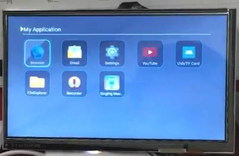
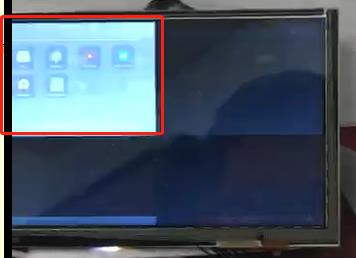
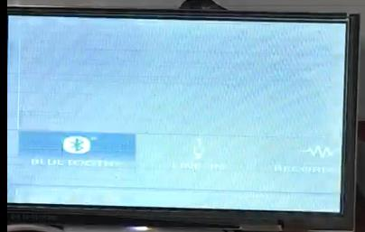

# HDMI-双屏同显-RK3128支持双屏同显方案

文件标识：RK-PC-YF-0002

发布版本：V1.0.0

日期：2020-07-02

文件密级：□绝密   □秘密   □内部资料   ■公开

---

**免责声明**

本文档按“现状”提供，瑞芯微电子股份有限公司（“本公司”，下同）不对本文档的任何陈述、信息和内容的准确性、可靠性、完整性、适销性、特定目的性和非侵权性提供任何明示或暗示的声明或保证。本文档仅作为使用指导的参考。

由于产品版本升级或其他原因，本文档将可能在未经任何通知的情况下，不定期进行更新或修改。

**商标声明**

“Rockchip”、“瑞芯微”、“瑞芯”均为本公司的注册商标，归本公司所有。

本文档可能提及的其他所有注册商标或商标，由其各自拥有者所有。

**版权所有** **© 2019** **瑞芯微电子股份有限公司**

超越合理使用范畴，非经本公司书面许可，任何单位和个人不得擅自摘抄、复制本文档内容的部分或全部，并不得以任何形式传播。

瑞芯微电子股份有限公司

Rockchip Electronics Co., Ltd.

地址：     福建省福州市铜盘路软件园A区18号

网址：     [www.rock-chips.com](http://www.rock-chips.com)

客户服务电话： +86-4007-700-590

客户服务传真： +86-591-83951833

客户服务邮箱： [fae@rock-chips.com](mailto:fae@rock-chips.com)

----

**前言**

本文主要以**Defect #243080**为例，对 **RK3128支持双屏同显方案** 进行说明，整理调试流程，整理相关客户Redmine，提供相关工程师调试参考。

**读者对象**

本文档主要适用一下工程师：

技术支持工程师

软件开发工程师

**修订记录**

| 日期       | 版本 | 作者 | 修订说明 |
| ---------- | ---- | ---- | -------- |
| 2020-07-02 | V1.0 | 李斌 | 初始版本 |

**目录**

------

[TOC]

------

**关键词：HDMI，双屏同显，RK3128**

## 平台版本

​	适用平台：

| 芯片平台 | Android 版本       |
| -------- | ------------------ |
| RK3128   | Android 7.1 or low |


## 问题描述

RK3128 Android 7.1 

HDMI插拔过程中，LCD屏幕会出现画面缩放右上角，显示不全，花屏等现象，现象如下：

**正常显示：**



**显示缩放，显示不全：**




**花屏：**




## RK3128双屏同显原理介绍

RK3128 硬件只配置一个vop_l，理论上只能点亮一个显示屏。

由于RK3128额外内置Scaler模块（类似RK618），支持将输出的显示数据流一分为二，并且其中一路信号可以通过缩放适配后端的第二块屏幕，达到双屏同显的效果。

显示数据流传输路径如下

- 单屏显示：
  - RGB屏幕：vop->rgb
- 双屏同显：HDMI插入以后
  - HDMI：vop->hdmi
  - RGB屏幕：vop->hdmi->scaler->rgb

当然由于第二块屏幕是通过缩放适配到屏幕上，故建议客户的两块屏幕的宽高比最好相等或相近，否则图像会受到拉伸变形，影响输出效果。


### Scaler模块启用配置

在 dts 文件中将 disp-mode 设置为 ONE_DUAL:

```diff
// kernel/arch/arm/boot/dts/rk3128-sdk.dts
&fb {
        rockchip,disp-mode = <ONE_DUAL>;
        rockchip,uboot-logo-on = <1>;
};       
```

disp-mode 可选项为：ONE_DUAL / DUAL / NO_DUAL 对应语义为：

- ONE_DUAL：支持启用Scale模块实现双屏同显

- DUAL：为RK3288 支持选项，暂不考虑

- NO_DUAL：关闭Scale模块，HDMI插入时，关闭LCD输出，输出单路HDMI信号，仅保证一路显示


### 检测HDMI热插拔事件

HDMI热插拔事件发生后，系统需要完成如下操作，假定HDMI分辨率为1080p，LCD为720p：

#### 插入事件：

- vop分辨率设置为HDMI显示分辨率，vop->hdmi，最终输出1080p分辨率
- scaler输出分辨率设置为720p，vop->hdmi->scaler->rgb，最终输出720p分辨率

#### 拔出事件：

- vop分辨率设置为LCD显示分辨率，vop->rgb，最终输出720p分辨率


### 实现双屏同显的完整处理逻辑

#### 插入事件：

1. 检测HDMI插入事件，获取当前的HDMI分辨率信息；
2. 驱动关闭LCD背光（切换分辨率的过程可能会出现花屏，通过黑屏过渡）；
3. HWC触发强制刷新逻辑，强制系统刷新一帧，并且HWC将HDMI的分辨率信息同当前显示数据信息配置到VOP，并通过scaler缩放输出到RGB，进入双屏同显显示模式；
4. 驱动打开LCD背光，屏幕点亮。

#### 拔出事件：

1. 检查HDMI拔出事件，获取当前LCD分辨率信息
2. 驱动关闭LCD背光（切换分辨率的过程可能会出现花屏，通过黑屏过渡）
3. HWC触发强制刷新逻辑，强制系统刷新一帧，并且HWC将LCD的分辨率信息同当前显示数据信息配置到VOP，并关闭scaler通路，进入LCD单显模式。
4. 驱动打开LCD背光，屏幕点亮


## 问题说明

### 显示缩放 / 显示不全

检查相关参数设置：

```shell
rk3126c:/ # cat /sys/class/graphics/fb0/screen_info
xres:1920  
yres:1080  # screen_info 已经切换到HDMI分辨率 1920x1080p
fps:60
type:6
interlace:0

rk3126c:/ # cat /sys/class/graphics/fb0/disp_info
win0:enabled
xvir:1024  
xact:1024
yact:600
xdsp:1024  # 此处还是设置 1024x600，为LCD的屏幕分辨率
ydsp:600   
x_st:0
y_st:0
x_scale:1.0
y_scale:1.0
format:ARGB888
YRGB buffer addr:0x10802000
CBR buffer addr:0x00000000

win1:disabled
xvir:0
xact:0
yact:0
xdsp:320
ydsp:240
x_st:65354
y_st:65505
format:ARGB888
YRGB buffer addr:0x00000000
overlay:win1 on the top of win0
```

故问题定位为，HDMI插入后vop的分辨率没有按实际HDMI的分辨率去设置，而还是按LCD的分辨率设置，导致HDMI输出的内容为1920x1080全屏中的1024x600区域，即为左上角部分区域，而LCD屏幕由于在HDMI输出内容的基础之上再通过scaler缩放，故LCD屏幕显示内容与HDMI内容一致，未全屏显示屏幕内容。

首先，vop显示分辨率的切换方式有两种，分别位于kernel space 与 userspace 的HWC：

- Kernel内核完成切换动作：
  - 优点：上层HWC不需要对HDMI热插拔事件做任何处理，完全由kernel实现
  - 缺点：上层HWC必须采用GLES策略，部分场景可能会存在性能问题
- HWC完成切换动作：
  - 优点：上层HWC可以通过检测HDMI事件对显示策略做调整，适配最优显示策略
  - 缺点：无

基于上述考虑，RK3128-7.1 双屏同显方案统一采用HWC完成切换动作的版本

### 花屏 - 触发系统刷新后才能恢复

此花屏为分辨率切换过程中存在的花屏现象，故检查是否正确关闭与打开LCD背光即可。

并且检查HWC是否触发强制刷新的逻辑，重新配置VOP参数。

### 花屏 - HDMI插拔后才能恢复

通过调试设备最终定位到，当win1被系统配置输出时，此时接上HDMI则可复现花屏问题，对应参数如下：

```shell
rk3126c:/ # cat /sys/class/graphics/fb0/disp_info
win0:enabled
xvir:1024
xact:1024
yact:600
xdsp:1024
ydsp:600
x_st:0
y_st:0
x_scale:1.0
y_scale:1.0
format:ARGB888
YRGB buffer addr:0x10802000
CBR buffer addr:0x00000000

win1:enabled  # Win1 使能，该图层被设置为送显鼠标图层
xvir:32
xact:0
yact:0
xdsp:22
ydsp:28
x_st:435
y_st:117
format:ARGB888
YRGB buffer addr:0x10cb6000
overlay:win1 on the top of win0
```

此时插入HDMI，即可复现花屏现象，该问题黄家钗已经定位到存在相关寄存器的设置异常问题，目前还在解决。


## 解决方案

提供完整的方案补丁，HWC代码与Kernel 的相关补丁如下：

**HWC补丁：**此补丁包含强制刷新补丁，HDMI切换分辨率补丁

源代码位于该目录：[源码目录](patch/hardware/rockchip/hwcomposer) 请下载源码，替换对应目录文件即可


**Kernel补丁：**

- **关闭Kernel对HDMI插入后的分辨率切换操作：**此操作已经统一由HWC处理，Kernel 不需要额外处理。

  补丁位于该目录：[补丁目录](patch/kernel)，请下载补丁，检查kernel 是否包含该补丁；

- **关闭背光补丁：**此补丁需要根据客户实际的产品提供对应补丁，要求参照 **实现双屏同显的完整处理逻辑**。


### 显示缩放 / 显示不全

此问题与HDMI插入拔出系统的行为有关系，请参照 **实现双屏同显的完整处理逻辑** 查看对应的处理流程是否完整

### 花屏 - 触发系统刷新后才能恢复

此问题与HWC的强制刷新逻辑有关，更新HWC源码即可恢复，[源码目录](patch/hardware/rockchip/hwcomposer)

### 花屏 - HDMI插拔后才能恢复

此问题为Kernel 软件BUG，补丁如下：[0001-video-rockchip-lcdc-fix-scale-register-config-error.patch](patch/kernel/0001-video-rockchip-lcdc-fix-scale-register-config-error.patch)

## SDK commit

以上修改目前均已提交SDK，但是由于对外的版本暂无更新计划，故以补丁形式提供客户修改。


##相关Redmine

Defect #243080：https://redmine.rock-chips.com/issues/243080

