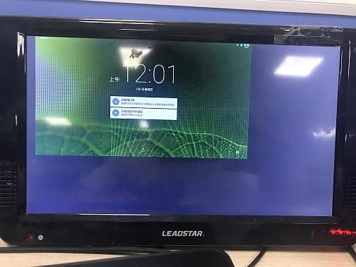
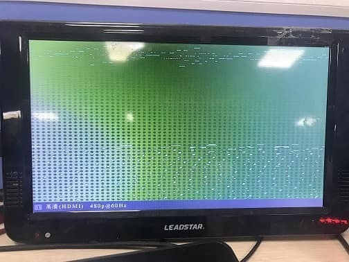
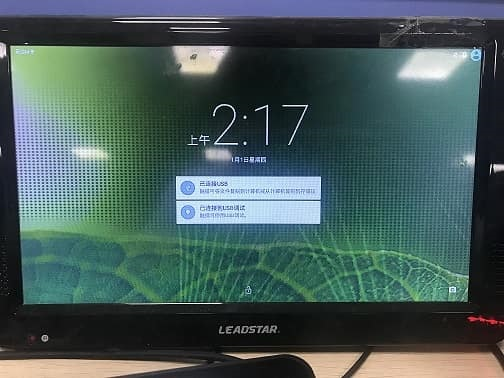
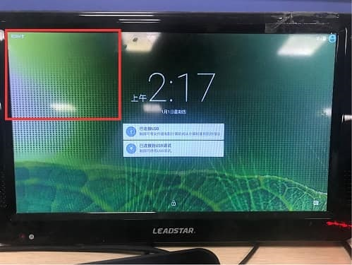

---

typora-copy-images-to: image
---

# HDMI-切换分辨率-显示不满屏问题-RK3188-5.1

文件标识：RK-PC-YF-0002

发布版本：V1.0.0

日期：2020-06-05

文件密级：□绝密   □秘密   □内部资料   ■公开

---

**免责声明**

本文档按“现状”提供，瑞芯微电子股份有限公司（“本公司”，下同）不对本文档的任何陈述、信息和内容的准确性、可靠性、完整性、适销性、特定目的性和非侵权性提供任何明示或暗示的声明或保证。本文档仅作为使用指导的参考。

由于产品版本升级或其他原因，本文档将可能在未经任何通知的情况下，不定期进行更新或修改。

**商标声明**

“Rockchip”、“瑞芯微”、“瑞芯”均为本公司的注册商标，归本公司所有。

本文档可能提及的其他所有注册商标或商标，由其各自拥有者所有。

**版权所有** **© 2019** **瑞芯微电子股份有限公司**

超越合理使用范畴，非经本公司书面许可，任何单位和个人不得擅自摘抄、复制本文档内容的部分或全部，并不得以任何形式传播。

瑞芯微电子股份有限公司

Rockchip Electronics Co., Ltd.

地址：     福建省福州市铜盘路软件园A区18号

网址：     [www.rock-chips.com](http://www.rock-chips.com)

客户服务电话： +86-4007-700-590

客户服务传真： +86-591-83951833

客户服务邮箱： [fae@rock-chips.com]

----

**前言**

本文主要对 **RK3188 Android5.1 HDMI切换分辨率显示异常的问题** 进行说明，整理调试流程，整理相关客户Redmine.

**读者对象**

本文档主要适用一下工程师：

技术支持工程师

软件开发工程师

**修订记录**

| 日期       | 版本 | 作者   | 修订说明 |
| ---------- | ---- | ------ | -------- |
| 2020-06-05 | V1.0 | 余乔伟 | 初始版本 |

[TOC]

------

**关键词：HDMI切换分辨率、显示不满屏、RK3188 Android5.1**

## 平台版本：

​	适用平台：

| 芯片平台   | Android 版本  |
| ------ | ----------- |
| RK3188 | Android 5.1 |


## 问题描述：

​	客户环境仅使用主屏幕，原始分辨率为1280x720p60；

​	使用一下两个命令切换分辨率

```c++
echo 1920x1080p-60 > /sys/class/display/HDMI/mode
echo 720x480p-60 > /sys/class/display/HDMI/mode
```

​		1.调整屏幕分辨率为1920x1080p60后，画面大小集中在屏幕左上角，约屏幕1/4大小，现象如下：



​		2.调整屏幕分辨率为720x480p60后，画面放大，且屏幕闪烁明显，现象如下：




## 问题分析：

​	**1.分析现象：**



​	这是开机后正常的720p的屏幕画面。

```c++
//抓取以下节点信息，查看显示设备信息
cat /sys/class/graphics/fb0/disp_info
cat /sys/class/graphics/fb0/screen_info
cat /sys/class/display/HDMI/mode
```

​	抓取当前的屏幕信息：

```c++
shell@rk3188:/ $ cat /sys/class/graphics/fb0/disp_info
win0:enabled
xvir:1920
xact:1280
yact:720
xdsp:1280
ydsp:720
x_st:260
y_st:25
x_scale:1.0
y_scale:1.0
format:ARGB888
YRGB buffer addr:0x95fa9000
CBR buffer addr:0x95ec8000

win1:enabled
xvir:1280
xdsp:1280
ydsp:720
x_st:260
y_st:25
format:ARGB888
YRGB buffer addr:0x93f18000
overlay:win1 on the top of win0
```

```c++
root@rk3188:/ # cat /sys/class/graphics/fb0/screen_info
xres:1280
yres:720
fps:60
```


​	上图是由720p切换到1080p后的显示图像，画面显示在屏幕的左上角，但是画面完整。

​	抓取当前屏幕信息：

```c++
root@rk3188:/ # cat /sys/class/graphics/fb0/disp_info	
win0:enabled
xvir:1920
xact:1280
yact:720
xdsp:1280			//与720p的参数一致
ydsp:720
x_st:192
y_st:41
x_scale:1.0
y_scale:1.0
format:ARGB888
YRGB buffer addr:0x9632d000
CBR buffer addr:0x9624c000

win1:enabled
xvir:1280
xdsp:1280
ydsp:720
x_st:192
y_st:41
format:ARGB888
YRGB buffer addr:0x93b94000
overlay:win1 on the top of win0
```

```c++
root@rk3188:/ # cat /sys/class/graphics/fb0/screen_info
xres:1920		//这里参数变更为1920x1080p60了
yres:1080
fps:60
```

​	这里可以看到，screen_info节点中的参数已经变更为1920x1080p60，但是disp_info节点中的参数值与正常720p的参数是一致的，再返回看画屏幕，就像是一张720p大小的图像显示在1080p的屏幕上。




​	上图是由720p切换到480p的显示图像，屏幕一直保持较高的频率闪烁，画面不完整，与正常显示的720p的图像进行对比发现明显是720p画面的左上角。

​	抓取当前屏幕信息：

```c++
root@rk3188:/ # cat /sys/class/graphics/fb0/disp_info
win0:enabled
xvir:1920
xact:1280
yact:720
xdsp:1280			//与720p的参数一致
ydsp:720
x_st:122
y_st:36
x_scale:1.0
y_scale:1.0
format:ARGB888
YRGB buffer addr:0x95fa9000
CBR buffer addr:0x95ec8000

win1:enabled
xvir:1280
xdsp:1280
ydsp:720
x_st:122
y_st:36
format:ARGB888
YRGB buffer addr:0x93810000
overlay:win1 on the top of win0
```

```c++
root@rk3188:/ # cat /sys/class/graphics/fb0/screen_info
xres:720		//这里参数变更为720x480p59了
yres:480
fps:59
```

​	根据这两个节点的信息对比1080p（异常）和720p（正常）发现，disp_info节点的信息不会随着分辨率切换而变化，screen_info会跟随分辨率切换而变化为对应的参数。

​	在其他可以正常切换分辨率的版本上，分别cat切换成1080p和480p后的disp_info节点

```c++
root@rk3188:/ # echo 1920x1080p-60 > /sys/class/display/HDMI/mode
root@rk3188:/ # cat /sys/class/graphics/fb0/disp_info
win0:enabled
xvir:1280
xact:1280
yact:720
xdsp:1920		//xdsp、ydsp这里参数根据分辨率而变化
ydsp:1080
x_st:192
y_st:41
x_scale:1.50	//x_scale、y_scale也又1.0变为了1.5，刚好1920/1280 = 1080/720 = 1.5
y_scale:1.50
format:ARGB888
YRGB buffer addr:0x92400000
CBR buffer addr:0x924e1000

win1:disabled
xvir:1280
xdsp:1280
ydsp:720
x_st:260
y_st:25
format:ARGB888
YRGB buffer addr:0x93f18000
overlay:win1 on the top of win0
```

```c++
root@rk3188:/ # echo 720x480p-60 > /sys/class/display/HDMI/mode
root@rk3188:/ # cat /sys/class/graphics/fb0/disp_info
win0:enabled
xvir:1280
xact:1280
yact:720
xdsp:720		//xdsp、ydsp这里参数根据分辨率而变化
ydsp:480
x_st:122
y_st:36
x_scale:0.56	//x_scale、y_scale也又1.0变为了0.56，刚好720/1280 = 0.56， 480/720 = 0.66
y_scale:0.66
format:ARGB888
YRGB buffer addr:0x92b08000
CBR buffer addr:0x92be9000

win1:disabled
xvir:1280
xdsp:1280
ydsp:720
x_st:260
y_st:25
format:ARGB888
YRGB buffer addr:0x93f18000
overlay:win1 on the top of win0
```

​	screen_info是当前设置的显示分辨率的模式，而disp_info是显示画面的参数根据上面两种切换分辨率后的现象，根据显示异常的1080p、720p与显示正常的1080p、720p的两个节点的参数对比，可以明显的看出分别是一张小的图片（720p）显示在一块较大的屏幕上（1080p）、一张大的图片（720p）显示在一块较小的屏幕上（480p），可以猜想是否是修改了分辨率大小而系统中没有对画面进行对应的缩放，从而导致了这样的现象。

​	**2.打印相关Log:**

```c++
  //系统启动后输入以下命令
  1.adb shell setprop sys.hwc.log 511
  2.adb shell logcat -c ;logcat > hwc.log
  //输入完复现问题场景
```
​	**3.分析Log:**

​	hwc.log中主要关注HWC对显示画面的参数设置部分log：

```c++
D/hwcomposer(   92): layer[0],name=com.android.settings/com.android.settings.SubSettings,hanlde=40871b70,tra=0,flag=0
D/hwcomposer(   92): layer[0],fmt=1,usage=f02,protect=4000
D/hwcomposer(   92): layer[1],name=DimLayer,hanlde=0,tra=0,flag=1
D/hwcomposer(   92): layer[2],name=com.android.settings/com.android.settings.SubSettings,hanlde=41438940,tra=0,flag=0
D/hwcomposer(   92): layer[2],fmt=1,usage=f02,protect=4000
D/hwcomposer(   92): layer[3],name=StatusBar,hanlde=40871c50,tra=0,flag=0
D/hwcomposer(   92): layer[3],fmt=1,usage=f02,protect=4000
D/hwcomposer(   92): layer[4],name=NavigationBar,hanlde=41438860,tra=0,flag=0
D/hwcomposer(   92): layer[4],fmt=1,usage=f02,protect=4000
D/hwcomposer(   92): layer[5],name=Sprite,hanlde=40871940,tra=0,flag=0
D/hwcomposer(   92): layer[5],fmt=1,usage=8933,protect=4000
D/hwcomposer(   92): line=710,num=6,special=0
D/hwcomposer(   92): rga policy skip,flag=1,hanlde=0
D/hwcomposer(   92): exit line=865,is hdmi
D/hwcomposer(   92): exit line=970,is hdmi
D/hwcomposer(   92): exit line=1083,is hdmi
D/hwcomposer(   92): vop_gpu skip,flag=1,hanlde=400944a7
D/hwcomposer(   92): cmp_mode=HWC_GPU,num=6
D/hwcomposer(   92): list=0x0,list_p=0x4096a800
D/hwcomposer(   92): [6->7],win_index=0,step=1
//这里打印出的信息可以看出本应[0,0,1280,720]=>[0,0,1920,1080]。但是这里却=>[0,0,1280,720]
D/hwcomposer(   92): primary:,par[0],area[0],z_win_galp[0,0,0],[0,0,1280,720]=>[0,0,1280,720],w_h_f[1280,2160,5],acq_fence_fd=40,fd=31,addr=0
```
​	可以看到1280x720的分辨率经过HWC处理后依旧是1280x720，进一步印证了前面系统没有对画面进行缩放的说法。

​	**4.阅读源码，添加相关打印，定位问题代码，提供解决方案。**

​	阅读源码后发现，rk3188 5.1版本中HWC并没有针对切换分辨率进行缩放的相关函数代码，因此导致屏幕分辨率无论如何变化，源图像大小永远为默认的720p大小，从而导致了上述问题。


## 解决方案：

​	在该版本HWC中添加对应的根据屏幕分辨率处理源图像的代码：

​	**1.获取当前显示分辨率的模式**

​	通过open()函数来打开screen_info节点，获取到当前需要显示的分辨率大小，并赋值给新定义的relx/yres变量，用来与原本的源图像大小x/yres进行对比，检测是否需要对源图像进行缩放显示。

​	**2.针对每一帧图像进行检测并进行缩放**

​	在每一帧图像配置到VOP的前判断是否需要缩放，需要的话在vop_config中将对应的值赋值给对应的参数，保证源图像根据当前显示的分辨率模式进行缩放，避免出现上述提到的问题的状况。

​	**3.显示参数配齐后针对硬件VOP的限制进行修正**

​	由rk3188的VOP两个win仅win0支持缩放，所以还需要在try_hwc_vop_policy()、try_hwc_vop_gpu_policy()两个策略中对需要画面缩放的图层进行限制。

​	**4.编译后打入patch**

​	在hardware/rockchip/hwcomposer 目录打补丁：

补丁文件位于以下目录：[./patch/hardware/rockchip/hwcomposer](./patch/hardware/rockchip/hwcomposer)


## SDK commit

| 芯片平台 | 版本号 |
| -------- | ------ |
| RK3188   | 2.78   |

    仓库：hardware/rockchip/hwcomposer
    分支：rk/phone/5.0/hwc_new_policy
    
    commit 387df8405c1ac6bf9e1a4cb083373c74d90134b0
    Author: libin <bin.li@rock-chips.com>
    Date:   Wed Jun 10 16:26:20 2020 +0800
    
        Add HDMI switch resolution function
        
        Signed-off-by: Yu Qiaowei <cerf.yu@rock-chips.com>


##相关Redmine：

- Support #250075 ：<https://redmine.rock-chips.com/issues/250075>

  RK3188 HDMI 切换分辨率显示异常