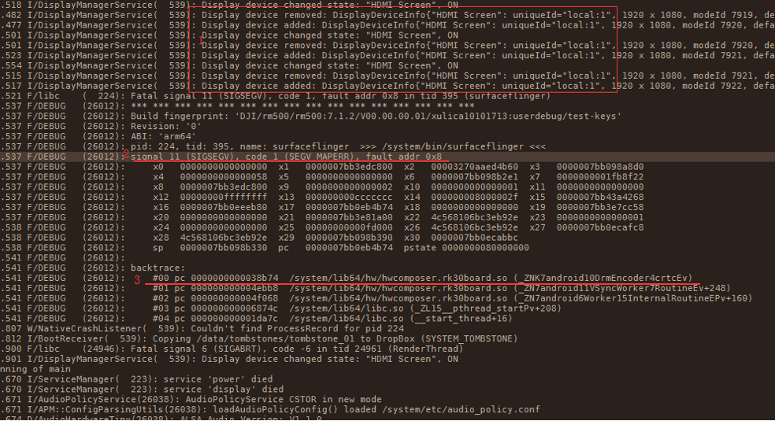
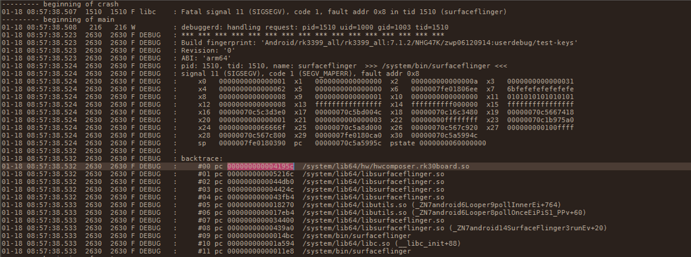
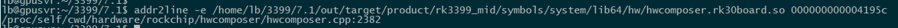
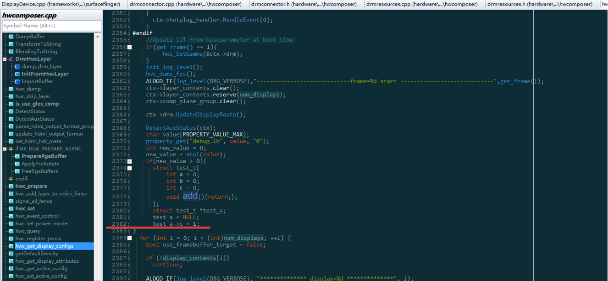
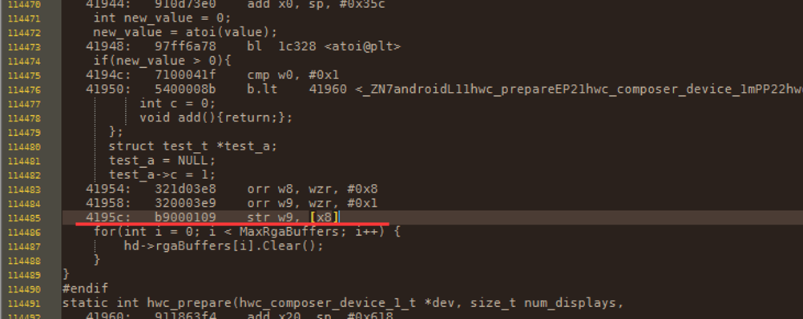
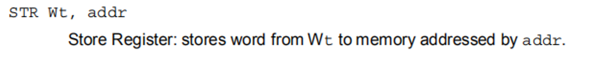
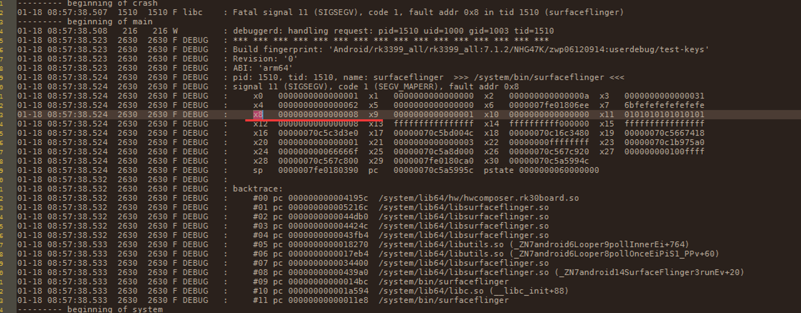
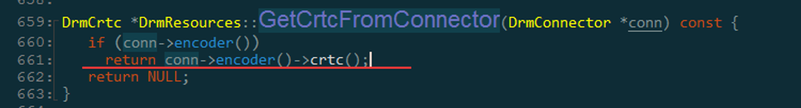
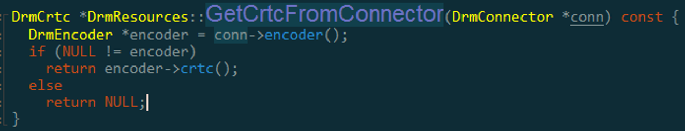

# Monkey+HDMI插拔拷机概率导致系统重启问题

**关键词：** **Monkey、HDMI插拔、系统重启**

发布版本：1.0

作者邮箱：bin.li@rock-chips.com

日期：2020.02

文件密级：公开

----

**前言**

本文主要对 Monkey+HDMI插拔拷机概率导致系统重启问题 进行分析，提供解决类似问题思路，帮助相关同事理解解决问题的过程与掌握相关调试方法。

**读者对象**

本文档主要适用一下工程师：

技术支持工程师

软件开发工程师

**修订记录**

| 日期       | 版本 | 作者 | 修订说明 |
| ---------- | ---- | ---- | -------- |
| 2020-02-18 | V1.0 | 李斌 | 初始版本 |

---

[TOC]

## 平台版本：

RK3399 7.1


## 问题描述：

客户在 Monkey + HDMI插拔拷机场景，大概率出现系统重启问题。


## 问题分析：

1. **确定复现场景：**

   客户发现monkey + HDMI插拔拷机场景会出现framework crash重启问题，并且复现概率为80%以上。

2. **分析相关日志**：

   - logcat日志：

   
   根据日志内容可得信息：

   a) 方框1：问题场景确实存在Display Devices 添加与删除工作，与HDMI插拔拷机场景相符。
   
   b) 划线2：SIGSEGV surfaceflinger进程执行了一次无效引用，引用地址为0x8。
   
   c) 划线3：现场堆栈打印，可通过反编译定位出错代码行。

   
   
   **重点分析b,c 两点：**
   
   b) 引用的错误地址为0x8，**在一个对象为空指针的情况下，指向这个空对象的成员或成员函数则会引用诸如0x8的空指针异常**，故0x8等同于0x0，也是一个空指针异常。
   
   

   该结论分析如下：
   
   我们通过构造该错误，在HWC代码适当位置加上如下代码：
   
   ```c++
   struct test_t{    
       int a = 0;    
       int b = 0;    
       int c = 0;    
       void add(){return;};    
   };    
   struct test_t *test_a;    //构造test_a  
test_a = NULL;            //设置为NULL  
   test_a->c = 1;            //访问NULL指针的成员  

   ```

   

   更新入设备后即可重新问题打印，具体打印如下：

   
   
   

   通过addr2line 命令可反编译到现场出错位置：

   ```shell
addr2line -e $OUT/symbols/system/lib64/hw/hwcomposer.rk30board.so 000000000004195c
   ```

   

   命令输出如下：

   

   

   对应代码行如下：
   
   即可定位问题代码行，通过构造的错误复现现场问题，从而定位问题。

   
   
   我们进一步分析问题，通过以下命令可以反汇编，将对应汇编源码输出：
   
   ```shell
   prebuilts/gcc/linux-x86/aarch64/aarch64-linux-android-4.9/bin/aarch64-linux-android-objdump -S -D $OUTsymbols/system/lib64/hw/hwcomposer.rk30board.so > hwcomposer.dump
   ```
   
   在输出文件hwcomposer.dump 查询4195c堆栈打印地址位置，如下图：



   即可得对应汇编代码，出现了问题：

```c
41958:  320003e9    orr w9, wzr, #0x1  //w9写入0x1立即数
4195c:  b9000109    str w9, [x8]     //将w9内容存储到x8指向的地址中
```

   通过查询ARM 汇编命令手册：



   即str 汇编命令：将Wt的内容存储到addr指向的内存中。即将w9内容存储到x8寄存器所指向的内存中，

   因此可查看x8寄存器所存储内容：



   x8寄存器所存储的地址就是0x8，也就是最终引用地址出错的地址.

   至此我们可得结论：

   **在对象为空指针的情况下，指向这个对象的成员或成员函数则会引用诸如0x8的空指针异常**


c) 可通过 addr2line 命令反编译找到源代码代码行：

```shell
addr2line -e $OUT/symbols/system/lib64/hw/hwcomposer.rk30board.so 38b74
```

可定位代码行为如下图：



分析代码逻辑，可知if空指针判断后，存在conn->encoder() 返回值被改写的场景，根据拷机场景为HDMI插拔，故有可能在空指针判断后，因为热插拔事件导致conn->encoder()被设置为NULL，继而去引用其成员函数crtc()导致空指针异常。


3. **定位问题，解决问题：**

   将该行逻辑修改为如下所示，最终解决该问题：

   


## 相关Redmine:

- [x] ​	Defect #177719：<https://redmine.rockchip.com.cn/issues/177719#change-1654879>：

  ​		大疆 rk3399_android7.1_sdk_v1.00 HDMI输出4K状态下画面卡顿严重


