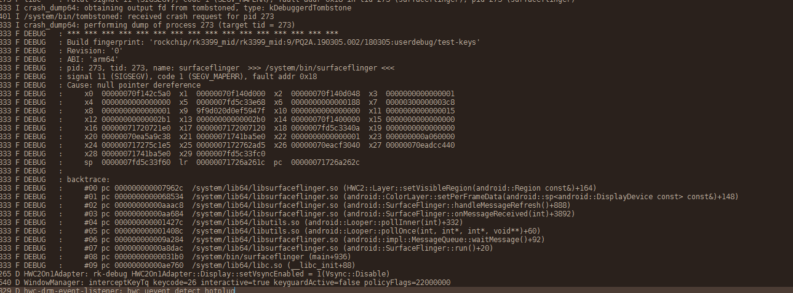
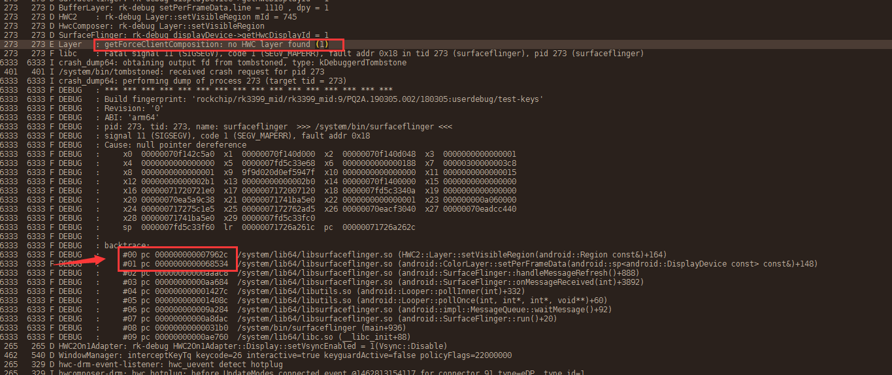
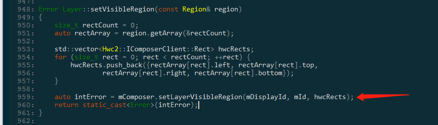
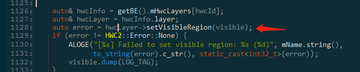

# 休眠唤醒+HDMI插拔拷机概率导致系统重启问题

**关键词：** **休眠唤醒、HDMI插拔、系统重启**

发布版本：1.0

作者邮箱：bin.li@rock-chips.com

日期：2020.02

文件密级：公开

----

**前言**

本文主要对 休眠唤醒+HDMI插拔拷机概率导致系统重启问题 进行分析，提供解决类似问题思路，帮助相关同事理解解决问题的过程与掌握相关调试方法。

**读者对象**

本文档主要适用一下工程师：

技术支持工程师

软件开发工程师

**修订记录**

| 日期       | 版本 | 作者 | 修订说明 |
| ---------- | ---- | ---- | -------- |
| 2020-02-18 | V1.0 | 李斌 | 初始版本 |

---

[TOC]

## 平台版本：

| 芯片平台      | Android 版本             |
| ------------- | ------------------------ |
| RK3399        | Android 8.1 / 9.0 / 10.0 |
| RK3368        | Android 8.1 / 9.0 / 10.0 |
| RK3288        | Android 8.1 / 9.0 / 10.0 |
| RK3326 / PX30 | Android 8.1 / 9.0 / 10.0 |
| RK3328        | Android 8.1 / 9.0 / 10.0 |


## 问题描述：

问题复现需要以下条件：

- 频繁切换HDMI，目的是频繁上报热插拔事件：利用以下脚本切换HDMI连接状态：

```sh
while true
do
echo off > sys/class/drm/card0-HDMI-A-1/status
usleep 200
echo detect > sys/class/drm/card0-HDMI-A-1/status
usleep 200
done
```

- 频繁休眠唤醒

复现问题后出现如下打印，最终导致系统重启：




## 问题分析：

1. **确定复现场景：**

   复现场景方法如问题描述

2. **分析相关日志**：

   - logcat日志：

   
   根据日志内容可得信息：

   a) getForceClientComposition: no HWC layer found ，关注到这个报错信息
   
   b) crash log 堆栈信息，可利用相关命令定位到问题现场代码
   
   


a)  根据该报错信息，可以定位到如下代码：

```c++
//frameworks/native/services/surfaceflinger/Layer.cpp:670
bool Layer::getForceClientComposition(int32_t hwcId) {
    if (getBE().mHwcLayers.count(hwcId) == 0) { 
        ALOGE("getForceClientComposition: no HWC layer found (%d)", hwcId);
        return false;
    }

    return getBE().mHwcLayers[hwcId].forceClientComposition;
}
```

根据上下文可得：getBE().mHwcLayers 结构中无法找到 hwcId 对应的hwcLayer


b) crash log 信息可以得到以下信息：

- 空指针异常：signal 11 (SIGSEGV), code 1 (SEGV_MAPERR), fault addr 0x18
- backtrace：异常现场的堆栈打印

综上，问题可能为系统遇到空指针，那么此时去查看堆栈打印，通过以下命令，反编译目标代码：

```shell
addr2line -e $OUT/symbols/system/lib64/libsurfaceflinger.so 000000000007962c
addr2line -e $OUT/symbols/system/lib64/libsurfaceflinger.so 0000000000068534
```


**堆栈地址（000000000007962c）反编译结果：**

```c++
//frameworks/native/services/surfaceflinger/DisplayHardware/HWC2.cpp
```




**堆栈地址（0000000000068534）反编译结果：**

```c++
//frameworks/native/services/surfaceflinger/BufferLayer.cpp 
void BufferLayer::setPerFrameData(const sp<const DisplayDevice>& displayDevice) {
    // Apply this display's projection's viewport to the visible region
    // before giving it to the HWC HAL.
    const Transform& tr = displayDevice->getTransform();
    const auto& viewport = displayDevice->getViewport();
    Region visible = tr.transform(visibleRegion.intersect(viewport));
    auto hwcId = displayDevice->getHwcDisplayId();
    auto& hwcInfo = getBE().mHwcLayers[hwcId];
    auto& hwcLayer = hwcInfo.layer;
    auto error = hwcLayer->setVisibleRegion(visible);//目标堆栈调用位置
    if (error != HWC2::Error::None) {
        ALOGE("[%s] Failed to set visible region: %s (%d)", mName.string(),
              to_string(error).c_str(), static_cast<int32_t>(error));
        visible.dump(LOG_TAG);
    }
```




结合两个报错信息，以及代码上下文，我们可以分析得到问题定位：

```c++
//frameworks/native/services/surfaceflinger/BufferLayer.cpp 
void BufferLayer::setPerFrameData(const sp<const DisplayDevice>& displayDevice) {
    // Apply this display's projection's viewport to the visible region
    // before giving it to the HWC HAL.
    const Transform& tr = displayDevice->getTransform();
    const auto& viewport = displayDevice->getViewport();
    Region visible = tr.transform(visibleRegion.intersect(viewport));
    auto hwcId = displayDevice->getHwcDisplayId();
    //此处也是利用hwcId获取hwcLayer，但是在此之前，已经打印了无法找到目标Layer的报错
    //故此时获取到的应该是个异常值，所以问题怀疑此处存在异常
    auto& hwcInfo = getBE().mHwcLayers[hwcId]; 
    auto& hwcLayer = hwcInfo.layer;
    auto error = hwcLayer->setVisibleRegion(visible);//目标堆栈调用位置
    if (error != HWC2::Error::None) {
        ALOGE("[%s] Failed to set visible region: %s (%d)", mName.string(),
              to_string(error).c_str(), static_cast<int32_t>(error));
        visible.dump(LOG_TAG);
    }
```

3. **提供补丁，验证问题：**

补丁思路为 getForceClientComposition 同样的验证方法应用与此处，安排拷机

```diff
diff --git a/services/surfaceflinger/BufferLayer.cpp b/services/surfaceflinger/BufferLayer.cpp
old mode 100644
new mode 100755
index 353c4e3..2b67d49
--- a/services/surfaceflinger/BufferLayer.cpp
+++ b/services/surfaceflinger/BufferLayer.cpp
@@ -1107,6 +1107,22 @@ void BufferLayer::setPerFrameData(const sp<const DisplayDevice>& displayDevice)
     const auto& viewport = displayDevice->getViewport();
     Region visible = tr.transform(visibleRegion.intersect(viewport));
     auto hwcId = displayDevice->getHwcDisplayId();
+    if (getBE().mHwcLayers.count(hwcId) == 0) {
+        ALOGE("%s,line=%d, No HWC layer found (%d)",__FUNCTION__,__LINE__, hwcId);
+        return;
+    }
+
     auto& hwcInfo = getBE().mHwcLayers[hwcId];
     auto& hwcLayer = hwcInfo.layer;
     auto error = hwcLayer->setVisibleRegion(visible);
```


4. **拷机结果问题未复现，并且期间概率性的打印添加的报错log，故问题解决**


## 相关Redmine:

- Defect #243456：https://redmine.rockchip.com.cn/issues/243456

​		3399平台9.0版本多次点击主屏power按键出现重启现象，单屏版本不会出现

- Defect #240985：https://redmine.rockchip.com.cn/issues/240985

  厦门锐益达 RK3288W_ANDROID8.1_SDK_V1.0_20180508 HDMI插拔导致系统服务重启


