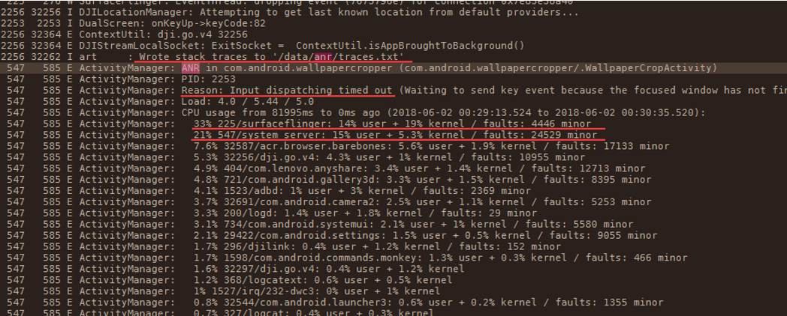
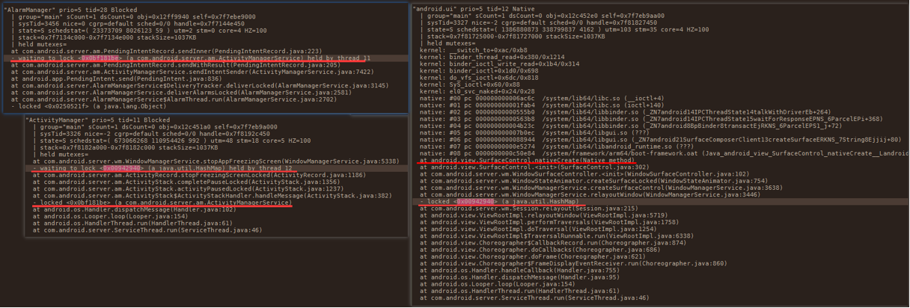
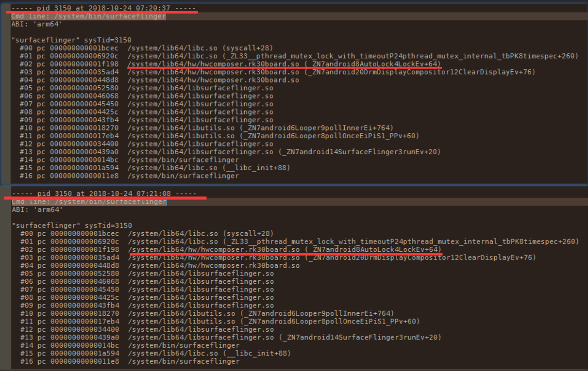
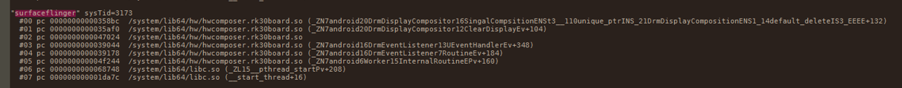
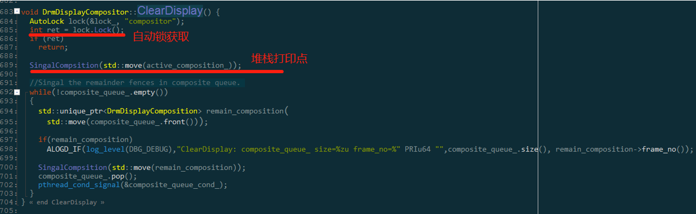
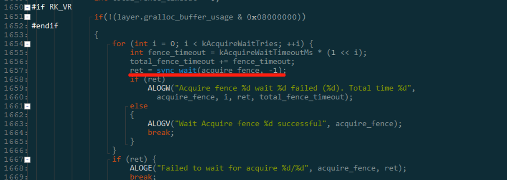
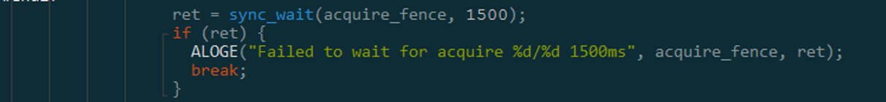

# Monkey+HDMI插拔拷机概率导致系统卡死问题

**关键词：** **Monkey、HDMI插拔、系统卡死**

发布版本：1.0

作者邮箱：bin.li@rock-chips.com

日期：2020.02

文件密级：公开

----

**前言**

本文主要对 Monkey+HDMI插拔拷机概率导致系统卡死问题 进行分析，提供解决类似问题思路，帮助相关同事理解解决问题的过程与掌握相关调试方法。

**读者对象**

本文档主要适用一下工程师：

技术支持工程师

软件开发工程师

**修订记录**

| 日期       | 版本 | 作者 | 修订说明 |
| ---------- | ---- | ---- | -------- |
| 2020-02-18 | V1.0 | 李斌 | 初始版本 |

---

[TOC]

## 平台版本：

RK3399 7.1

## 问题描述：

客户在 Monkey + HDMI插拔拷机场景，小概率出现系统卡死，系统无响应问题。

## 问题分析：

1. **确定复现场景：**

   客户发现monkey + HDMI插拔拷机场景小概率出现系统卡死，无响应问题。问题场景已确定。但由于复现概率小，log分析尤其重要。

2. **分析相关日志**：

   - logcat日志：

   

根据logcat日志内容可得信息：

a) com.android.wallpapercropper 输入事件超时，引发ANR事件

b) ANR发生前82s内 surfaceflinger CPU占用率为33%，system_server 为21%

c) 输出traces.txt文件到 /data/anr/traces.txt

   

   - traces.txt日志：

由该部分log可知：android.ui 在等待Native method 方法的返回，而android.view.SurfaceControl.nativeCreate 方法可知surfaceflinger serverces未在指定时间内处理该请求，引起ANR。因此，需要去查看surfaceflinger堆栈信息。

surfaceflinger堆栈信息：

由该log可知间隔30s的两次 surfaceflinger 堆栈信息均未改变，确定surfaceflinger进程存在阻塞行为；

检查surfaceflinger进程下的各线程的堆栈情况，发现hwc存在死锁行为：

线程sysTid = 3150（如上图）在等待 sysTid = 3173（如下图）释放lock，而 sysTid = 3173 存在阻塞问题，导致lock无法释放。进而引起hwc主线程阻塞，surfaceflinger进程阻塞。

所以我们可以通过 反编译命令 addr2line 找到问题现场的行号分析问题：

 

对应反编译源代码如下：

   

存在死锁现象，继而跟进代码，阻塞调用如下：

这是一个wait Fence函数，并且是无限制等待，只要acquireFence出现异常无法返回，该线程阻塞，锁无法释放，导致surfaceflinger进程阻塞，导致ANR，故问题定位为hwc线程死锁。

3. **定位问题，解决问题：**

   死锁问题可通过流程优化与超时机制解决，故此处问题采用超时机制解决该问题。

   

   设置超时时间1.5s，若达到1.5s释放该锁，则问题解决。

## 相关Redmine:

- [x] ​	Defect #177719：<https://redmine.rockchip.com.cn/issues/177719#change-1654879>：

  ​		大疆 rk3399_android7.1_sdk_v1.00 HDMI输出4K状态下画面卡顿严重

